# Laravel覚書

* 目次
    * [構造](#構造)
    * [設計思想](#設計思想)
    * [図解](#図解)
    * [参考サイト](#参考サイト)
    * [便利なVSCodeの拡張機能](#便利なVSCodeの拡張機能)
    * [インストール](#インストール)
    * [ide-helper](#ide-helper)
    * [gitからcloneする時](#gitからcloneする時)
    * [サーバー起動](#サーバー起動)
    * [.env.exampleの設定](#.env.exampleの設定)
    * [XAMPPでMySQLが起動しない時の対処法](#XAMPPでMySQLが起動しない時の対処法)
    * [namespace](#namespace)
    * [日付操作(CarbonImmutable)](#日付操作(CarbonImmutable))
    * [nullsafe演算子](#nullsafe演算子)
    * [Enum](#Enum)
    * [trait](#trait)
    * [マイグレーション](#マイグレーション)
    * [モデル](#モデル)
        * [インスタンスメソッド(モデル)](#インスタンスメソッド(モデル))
        * [クラスメソッド(モデル)](#クラスメソッド(モデル))
        * [クエリビルダーメソッド(モデル)](#クエリビルダーメソッド(モデル))
        * [クエリ実行メソッド(モデル)](#クエリ実行メソッド(モデル))
        * [クエリスコープ(モデル)](#クエリスコープ(モデル))
        * [ソフトデリート(モデル)](#ソフトデリート(モデル))
        * [Eloquent\Collectionメソッド(モデル)](#Eloquent\Collectionメソッド(モデル))
        * [リレーション(モデル)](#リレーション(モデル))
        * [アクセサとミューテタ(モデル)](#アクセサとミューテタ(モデル))
        * [isとisNotメソッドで比較(モデル)](#isとisNotメソッドで比較(モデル))
        * [イベント(モデル)](#イベント(モデル))
    * [シーダー](#シーダー)
    * [ファクトリー](#ファクトリー)
    * [ルーティング](#ルーティング)
    * [リダイレクト](#リダイレクト)
    * [GET/POST](#GET/POST)
    * [コントローラー](#コントローラー)
    * [DIコンテナ](#DIコンテナ)
    * [サービスプロバイダ](#サービスプロバイダ)
    * [リクエスト](#リクエスト)
        * [バリデーションルール](#バリデーションルール)
    * [lang](#lang)
    * [サービス](#サービス)
    * [ビュー](#ビュー)
    * [Breeze](#Breeze)
    * [Breezejp](#Breezejp)
    * [ミドルウェア](#ミドルウェア)
    * [TailwindCSS](#TailwindCSS)
    * [Facade](#Facade)
    * [セッション](#セッション)
    * [ユーザーアクションの認可](#ユーザーアクションの認可)
    * [ファイルのアップロード](#ファイルのアップロード)
    * [イベント購読](#イベント購読)
    * [テスト](#テスト)


<a id="構造"></a>
## 構造

--------

* 基本設定  
* リソース
    * アクション
        * ルーティング
        * バリデーション
        * ドメインロジック(モデル使用)
        * ビュー
* その他便利機能  

----------


リソース(アクション)とレイヤー

* アクション
    * ルーティング
    * バリデーション
    * ドメインロジック(この中でモデルを使用)
    * ビュー

Laravelはリソース志向。  
各レイヤーは密結合になっても良い。  
Livewireもそういうアプローチ。  

+基本設定  
+その他便利機能  

※「同一リソース」でもコンテキストが異なればコントローラーを分けるのは有効


必須級  
Composer  
Configuration  
Artisan Console  
  
Routing  
FormRequest  
Controller  
Blade Templates  
Livewire  
  
Service  
  
Model  
Migration  
seeder  
factory  
  
DI Container  
Middleware  
Service Provider  
  
Auth  
    
  
  
準必須級  
キャッシュ (Cache)  
イベント (Events)  
キュー (Queues)  
アセット (Assets)  


### フロントエンド的処理
* 枠組み(Laravel)
    * コントローラー
* 機能(Laravel)
    * ルーティング
    * リクエスト
    * ビュー

### バックエンド的処理
* 枠組み(自作)
    * サービス
* 機能(Laravel)
    * DB操作
        * モデル
        * シーダー
        * ファクトリー
        * マイグレーション
    * 認証・認可
    * イベントリスナー


<a id="設計思想"></a>
## 設計思想
設計思想に沿った使い方をすることで、フレームワークの強みを最大限に活かすことができる。

Laravelはどこまでもモノリス的でリソース志向  
モノリスの中で、「リソース」や「アクション」という単位で概念を括る。  
独立性が高いリソース群が複数ある場合は、モジュラモノリスがフィットする。  


### モノリス
アプリケーション全体を包括的に管理する。  
フルスタックフレームワークである。  
フレームワークが提供しうる機能は(ほぼ)全て用意されている。  
開発者はビジネスロジック部分に集中できる。  

### Service層
全てのビジネスロジック(データアクセスの処理も含む)をサービス内に書く。    
Servicesディレクトリ内に、ActionsディレクトリとDtoディレクトリを作る。  
Repository層は作らない。    
モデル特有の処理はモデルに書く    

Actionsディレクトリ内では、各リソースごとにディレクトリを作り、各アクションごとにファイル(クラス)を作る。

サービスクラスの肥大化を避けるため、状況に応じて責務ごとに小さなサービスに分割する。

Routing、Controller、FormRequest、Viewを「フロントエンド的処理」、  
Service(use Model)を「バックエンド的処理」として分離した形にする。

Controllerの責務は  
リクエストを受け取りバリデーションチェックする  
サービスへ値を渡す  
レスポンスを返す  
の３つのみ。  
例外は無し

共通の処理は、Serviceディレクトリ直下に○○Service.phpとして作る。  
共通化(トレイト含む)は明確に有用な場合のみ。少しでも迷ったら共通化しない。

app/Http/Requests/Post/StoreRequest.php  
public function store(StoreRequest $request, StoreAction $action)


### DTO
内部でデータを受け渡す際は、DTO（Data Transfer Object）を使用してひとまとめにする。  
DTOは「適切なデータの抽象化と制御」という発想においてAPIと似ているが、APIを使うのはマイクロサービス的な考え方でありLaravelの設計思想とはやや異なる


<a id="図解"></a>
## 図解
  
  


1234

model

resource  
action

コントローラー：各処理をまとめて分類しておく  
ルーティング：各処理に名前付け  
アクション発動スイッチには、発動させたい処理(アクション)の名前を指定しておく

request→action→dto→view


app/Dto
app/Dto/Actions
app/Dto/Common
app/Dto/??????

app/Services
app/Services/Actions
app/Services/Common
app/Services/??????


<a id="参考サイト"></a>
## 参考サイト
[ベストプラクティス](https://github.com/alexeymezenin/laravel-best-practices/blob/master/japanese.md)

<a id="便利なVSCodeの拡張機能"></a>
## 便利なVSCodeの拡張機能

* PHP Intelephense
* laravel extension pack

<a id="インストール"></a>
## インストール

### カレントディレクトリにlaravelをインストールしてプロジェクトを自動生成するコマンド 
`composer create-project laravel/laravel [プロジェクト名]`  
(プロジェクトを作るたびにlaravelをインストールする必要がある)  
(基本的にはC:\xampp\htdocs内でコマンドを実行)  


<a id="ide-helper"></a>
## ide-helper

### プロジェクトのルートディレクトリで実行
`composer require --dev barryvdh/laravel-ide-helper`
### 設定ファイルの公開
`php artisan vendor:publish --provider="Barryvdh\LaravelIdeHelper\IdeHelperServiceProvider"`
### メタファイルの生成
`php artisan ide-helper:generate`
### モデルのPHPDoc生成
`php artisan ide-helper:models`


<a id="gitからcloneする時"></a>
## gitからcloneする時

### 概要
git cloneしてきたLaravelプロジェクトにはvendorディレクトリと.envファイルが含まれていないので、作成する必要がある。
※vendorディレクトリと.envファイルは、通常Gitの管理下におかない(初期状態で.gitignoreに入っている)。

### vendorディレクトリを作る
下記のコマンドを実行する。  
`composer install`

### .envファイルを作る
.env.exampleファイルを下記のコマンドでコピーして.envファイルを作成する。  
`cp .env.example .env`

### アプリケーションキーを初期化する
.env.exampleをコピーして.envを作成してもアプリケーションキーは設定されていないので、下記コマンドで設定する。  
`php artisan key:generate`
#### ※アプリケーションキーとは？
.envファイルのAPP_KEY=の項目。暗号化された値を安全に扱うためのもの。


<a id="サーバー起動"></a>
## サーバー起動

### サーバー起動コマンド  
`php artisan serve`

<a id=".env.exampleの設定"></a>
## .env.exampleの設定

### .env.exampleファイル
```
APP_TIMEZONE=Asia/Tokyo #タイムゾーン設定

APP_LOCALE=ja #言語設定
APP_FALLBACK_LOCALE=en
APP_FAKER_LOCALE=ja_JP #フェイクデータの言語設定

# mysqlを使う場合
DB_CONNECTION=mysql #接続するRDBMS名
DB_HOST=127.0.0.1 #使用するホスト名
DB_PORT=3306 #使用するポート番号
DB_DATABASE=first_db  #接続するデータベース名
DB_USERNAME=root
DB_PASSWORD=
DB_CHARSE=utf8mb4          # 追記：文字コード設定
DB_COLLATION=utf8mb4_general_ci   # 追記：照合順序

# sqliteを使う場合
DB_CONNECTION=sqlite
```

### .env.exampleの設定を.envにコピーする。  
`cp .env.example .env`


### env関数

```php
// .envファイルやサーバーの環境変数に定義された値を取得する。
// 第一引数: .envファイル等に定義した環境変数のキー。
// 第二引数（オプション）: 環境変数が設定されていない場合に返すデフォルト値。
env('APP_TIMEZONE', 'UTC')
```


### config/app.php
```php
// .envファイルのAPP_TIMEZONEに設定があればそちらを採用。なければ第二引数の'UTC'にする。
'timezone' => env('APP_TIMEZONE', 'UTC'),
```

### config\database.php
```php

'sqlite' => [
    // SQLiteを使用する場合、データベースファイルを database ディレクトリに保存することが一般的
    // database_path 関数は、プロジェクト内の database ディレクトリの絶対パスを返す ヘルパー関数
    'database' => env('DB_DATABASE', database_path('database.sqlite')),
],

'mysql' => [
    'charset' => env('DB_CHARSET', 'utf8mb4'),
    'collation' => env('DB_COLLATION', 'utf8mb4_general_ci'),
],
```

<a id="XAMPPでMySQLが起動しない時の対処法"></a>
## XAMPPでMySQLが起動しない時の対処法

### 他で起動してるMySQLがないか確認

別のMySQLが動いていて、同じポートを使用しているとエラーになる。  
デフォルトのポート「3306」が使われているかどうかの確認は、XAMPP Control Panelの「NetStat」からできる。  

別のMySQLが動いていた場合は終了させる。  
管理者として実行したPowerShellで以下のコマンドを実行。   
`net stop mysql82`  
※82はmysqlのバージョンが8.2の場合。

mysqld.exeが動いていた場合はタスクマネージャーで終了させる。

<a id="namespace"></a>
## namespace


* オートローダーがクラスを探せるようにするための地図(目印)にすぎず、ディレクトリを跨いだ独自のスコープを形成しているわけではない。
* 名前と階層をディレクトリ構成と一致させる。
* オートローダーはnamespaceをファイルパスに変換し、対応するファイルを読み込む。

あるクラスを使用しようとしたとき
1. そのクラスが現在のファイル内で定義されている場合：それをそのまま使用。オートロードは実行されない。
1. そのクラスが現在のファイル内で定義されていない場合：オートローダーが起動し、名前空間に基づいてクラスを探しに行く。見つけたらそれを読み込んで使用。


<a id="日付操作(CarbonImmutable)"></a>
## 日付操作(CarbonImmutable)

### 予備知識：日付操作で使う主なもの
* 日付文字列 （型はstring）
* タイムスタンプ 1970年1月1日00:00:00UTCからの経過秒数 （型はint）
* Carbonインスタンス （型はCarbon）

### 予備知識：主な関数
```php
<?php

date("Y-m-d", $timestamp); // タイムスタンプを日付文字列としてフォーマット ※タイムスタンプは省略すると現在の日時となる

strtotime('2024-08-31'); // 日付文字列をタイムスタンプに変換
time() // 現在のタイムスタンプを返す

```

### クラスメソッド
```php
<?php

// CarbonImmutableインスタンスを生成
CarbonImmutable::now() // 現在の日時
CarbonImmutable::parse('2024-07-09') // 多種多様な日時文字列を指定できる
CarbonImmutable::parse($carbonInstance) // カーボンインスタンスも指定できる
```

### インスタンスメソッド
```php
<?php

// CarbonImmutableインスタンスを操作
// ※1日、1月、1年の場合は「Day」「Month」「Year」にして引数は無し。
$carbonInstance->addDays(9) // 指定日数を追加する @return \Carbon
$carbonInstance->subDays(3) // 指定日数を減らす @return \Carbon
$carbonInstance->addMonthsNoOverflow(2) // 日付あふれを許可せずに指定月を追加する @return \Carbon
$carbonInstance->subMonthsNoOverflow(2) // 日付あふれを許可せずに指定月を減らす @return \Carbon
$carbonInstance->addYearsNoOverflow(3) // 日付あふれを許可せずに指定年を追加する @return \Carbon
$carbonInstance->subYearsNoOverflow(5) // 日付あふれを許可せずに指定年を減らす @return \Carbon
$carbonInstance->startOfMonth() // 「その月の初日」にする @return \Carbon

// CarbonImmutableインスタンスから日時データを取得
$carbonInstance->format('H:i') // 指定した形式にフォーマットした日時を取得 @return string
$carbonInstance->toDateString() // 日付を取得する('Y-m-d') @return string
$carbonInstance->toTimeString() // 時間を取得する('H:i:s') @return string
$carbonInstance->toDateTimeString() // 日時を取得する('Y-m-d H:i:s') @return string
$carbonInstance->year // 年を取得 @var int
$carbonInstance->month // 月を取得 @var int
$carbonInstance->day // 日を取得 @var int
$carbonInstance->hour // 時間を取得 @var int
$carbonInstance->minute // 分を取得 @var int
$carbonInstance->second // 秒を取得 @var int
$carbonInstance->dayName // 曜日を文字列で取得 例：'月曜日' @var string
$carbonInstance->shortDayName // 曜日を短い文字列で取得 例：'月' @var string
// ※曜日を日本語の文字列で取得するには.envファイルに以下の設定が必要
// APP_TIMEZONE=Asia/Tokyo
// APP_LOCALE=ja


// CarbonImmutableインスタンスから差分を取得
$startCarbonInstance->diffInMinutes($endCarbonInstance); //差分を分数で取得する  @return float
```

### フォーマット文字

[ドキュメント](https://www.php.net/manual/ja/datetime.format.php)  

|主な文字|表すもの|
|-|-|
|Y|年（西暦の4桁） 例：2017|
|m|月（2桁の月） 例：08|
|d|日（2桁の日付） 例：21|
|H|時間（2桁の24時間単位） 例：16|
|i|分（2桁の分） 例：20|
|s|秒（2桁の秒） 例：30|
|D|曜日。3文字のテキスト形式。（Mon ～ Sun）|


### CarbonPeriodImmutableの使用
```php
<?php
// 特定の期間を配列で取得できる
$periods = CarbonPeriod::create('2024-07-01', '2024-07-31')->toArray();
// カーボンインスタンスも指定できる
$periods = CarbonPeriodImmutable::create(
    $carbonInstance->startOfMonth(),
    $carbonInstance->endOfMonth()
)->toArray()
```

### 人間にとって分かりやすい、相対的な時間の表現に変換

例えばdiffForHumansメソッドは、データベースに保存されている2023-10-27 10:30:00 のような形式の日時を、現在時刻と比較して以下のような文字列に変換してくれる。

* 5分前
* 2時間前
* 3日前
* 1ヶ月前
* 2年後 (未来の日時にも対応)

```php
// diffForHumansはCarbonが提供する機能の一つ。
// created_atやupdated_atといったカラムは、自動的にCarbonオブジェクトとして扱われる。
// そのため、以下のように直接メソッドを呼び出すことができる。
$modelInstance->created_at->diffForHumans();
```


### 参考サイト
[Carbonではなく「CarbonImmutable」を使う](https://qiita.com/kbys-fumi/items/b923cdfb09c8f5c35fce)  
[全217件！Carbonで時間操作する実例](https://blog.capilano-fw.com/?p=867)  
[Carbonで日付操作(比較, 差分, format)](https://www.wakuwakubank.com/posts/421-php-carbon/)  
[【PHP】DatetimeやCarbonの最大値/最小値取得、ソートを手軽に行う](https://pg.echo-s.net/%E3%80%90php%E3%80%91datetime%E3%82%84carbon%E3%81%AE%E6%9C%80%E5%A4%A7%E5%80%A4-%E6%9C%80%E5%B0%8F%E5%80%A4%E5%8F%96%E5%BE%97%E3%80%81%E3%82%BD%E3%83%BC%E3%83%88%E3%82%92%E6%89%8B%E8%BB%BD%E3%81%AB/)
[CarbonPeriod ドキュメント](https://carbon.nesbot.com/docs/#api-period)

<a id="nullsafe演算子"></a>
## nullsafe演算子

```php
<?php

// null評価のインスタンスから通常のアロー演算子でメソッドやプロパティを呼ぶと、エラーになる。
$todayWorkLog->activities
// nullsafe演算子を使用すると、エラーにはならずnullが返される。
$todayWorkLog?->activities
```


<a id="Enum"></a>
## Enum

### 基本
複数の定数をまとめて管理できる機能。

### Enumを作成するコマンド。
`php artisan make:enum EnumName`  

オプション  
`--string`：string型のBacked Enumを作成  
`--int`：int型のBacked Enumを作成  

実行すると、app配下にEnumが作成される。  
app/Enumsディレクトリを作っておくと、app/Enums配下に作成先が変わる。

### Enumの例
```php
<?php

namespace App\Enums;

enum UserType: string
{
    case WELFARE_USER = '利用者';
    case WELFARE_STAFF = '職員';
}
```
### Enumの値を呼び出す
```php
<?php

use App\Enums\UserType;

UserType::WELFARE_USER->value // '利用者'
UserType::WELFARE_STAFF->value // '職員'
```

<a id="trait"></a>
## trait

```php
<?php

namespace App\Traits;

// プロパティやメソッドを定義
trait CalculatorForUser
{
    private $hoge;
    public $fuga;

    private function piyo()
    {
        //
    }
}
```
```php
<?php

use App\Traits\CalculatorForUser;

class CalculatorForGeneral
{
    // クラス内でuseで使用
    // ※traitの内容をクラス定義に直接書き込んでいるのと同じ動作になる
    use CalculatorForUser;
}
```

<a id="マイグレーション"></a>
## マイグレーション

Migrationを使うと、テーブルの作成とテーブル構造の定義ができる。ただしデータを入れることはできない。  
操作がコードとして残るので、データベースのバージョン管理のような役割も果たす。  

### 参考サイト
[Laravel 11.x マイグレーション](https://readouble.com/laravel/11.x/ja/migrations.html)


### マイグレーションファイルの新規作成コマンド  
`php artisan make:migration create_テーブル名_table --create=テーブル名`  

※テーブル名は「格納したい物の名前の複数形」にするのが一般的な慣習。  
例：  
`php artisan make:migration create_work_logs_table --create=work_logs`  


### マイグレーションの構造

マイグレーションクラスには、upとdownの2つのメソッドを用意する。  
upメソッドはデータベースに新しいテーブル、カラム、またはインデックスを追加するために使用する。  
downメソッドでは、upメソッドによって実行する操作を逆にし、以前の状態へ戻す必要がある。  

```php
<?php
// Illuminateには、デフォルトで使える便利なクラスとメソッドが用意されている
// データベース操作用に、Migrationクラス、Blueprintクラス、Schemaクラスを名前空間でインポートする
use Illuminate\Database\Migrations\Migration;
use Illuminate\Database\Schema\Blueprint;
use Illuminate\Support\Facades\Schema;

// Laravel9以降では、Migrationクラスが継承された無名クラスが作成される
return new class extends Migration
{
    // upメソッド
    // データベースに新しいテーブルやカラムなどを作成するメソッド
    public function up(): void
    {
        // Schemaクラスのクラスメソッドcreate()を使用して、テーブルの作成とテーブル構造の定義を行う。
        // Schema::createメソッドの第一引数は作成するテーブルの名前
        // Schema::createメソッドの第二引数はテーブルの構造を定義するためのコールバック関数(無名関数)
        // そのコールバック関数は、Schema::createメソッドが内部で生成したBlueprintクラスのインスタンスを引数として受け取る(通常は$tableという変数名)
        // 無名関数内でそのインスタンスからインスタンスメソッドにアクセスし、カラムを作成する
        // $table->型名になっているインスタンスメソッド('カラム名');という書き方が基本。
        // 例外として、$table->datetimes();は、1行でcreated_atとupdated_atの2列を作成する。
        // table->unique()でユニーク制約をしておく。
        Schema::create('folders', function (Blueprint $table) {
            $table->id();
            $table->string('title', 20);
            $table->datetimes();
            $table->unique(['unit_price_id', 'welfare_user_id', 'date']);
        });

        // ※Schema::tableメソッドを使用すると既存のテーブルを更新できる。引数はSchema::createメソッドと同様。
    }

    // downメソッド
    // テーブルを削除するメソッド
    public function down(): void
    {
        // SchemaクラスのクラスメソッドdropIfExists()を使用してテーブルを削除する。
        // Schema::dropIfExists()の引数は削除するテーブルの名前
        // 指定した名前のテーブルが存在する場合にそのテーブルを削除する。存在しない場合は何もしない。
        Schema::dropIfExists('folders');

        // ※Schema::drop()でもいい。
        // Schema::drop('folders');
    }
};
```

### カラムを定義
```php
<?php

// カラム定義 整数型
$table->tinyInteger('column_name'); // TINYINT(-128~127)
$table->smallInteger('column_name'); // SMALLINT(-32768~32767)
$table->mediumInteger('column_name'); // MEDIUMINT(約-838万~約838万)
$table->integer('column_name'); // INT(約-21億~約21億)
$table->bigInteger('column_name'); // BIGINT(約-922京~約922京)

$table->unsignedTinyInteger('column_name'); // UNSIGNED TINYINT(0~255)
$table->unsignedSmallInteger('column_name'); // UNSIGNED SMALLINT(0~65535)
$table->unsignedMediumInteger('column_name'); // UNSIGNED MEDIUMINT(0~約1677万)
$table->unsignedInteger('column_name'); // UNSIGNED INT(0~約42億)
$table->unsignedBigInteger('column_name'); // UNSIGNED BIGINT(0~約1844京)

$table->tinyIncrements('id'); // 自動増分する主キーカラムを作成。UNSIGNED TINYINT
$table->smallIncrements('id'); // 自動増分する主キーカラムを作成。UNSIGNED SMALLINT
$table->mediumIncrements('id'); // 自動増分する主キーカラムを作成。UNSIGNED MEDIUMINT
$table->increments('id'); // 自動増分する主キーカラムを作成。UNSIGNED INT
$table->bigIncrements('id'); // 自動増分する主キーカラムを作成。UNSIGNED BIGINT
$table->id(); // $table->bigIncrements('id')のエイリアス。簡潔に書ける。

// カラム定義 少数型
// 合計○桁で小数点以下×桁の小数カラム
// 合計桁数は初期値が10、最大値が65。
// 小数点以下桁数は初期値が0、最大値が30。
$table->decimal('column_name', 合計桁数int, 小数点以下桁数int); 

// カラム定義 文字列型

// VARCHAR(0~65535バイト)。
// 第二引数で最大文字数を指定(省略すると255)
// 長い文にはあまり適さない。
$table->string('column_name', $length = 100); 
$table->tinyText('column_name'); // TINYTEXT(0~255バイト)
$table->text('column_name'); // TEXT(0~65535バイト)
$table->mediumText('column_name'); // MEDIUMTEXT(0~16777215バイト)
$table->longText('column_name'); // LONGTEXT(0~4294967295バイト)

// カラム定義 日時型
$table->date('column_name'); // YYYY-MM-DD
$table->time('column_name', $precision = 0); // hh:mm:ss
$table->dateTime('column_name', $precision = 0); // YYYY-MM-DD hh:mm:ss
$table->year('column_name'); // YYYY
$table->datetimes(); // created_atとupdated_atの2列を作成する。
$table->softDeletes('deleted_at', $precision = 0); // deleted_at カラムを追加(ここに書いてある引数はデフォルト値)


// カラム定義 ブール型
$table->boolean('column_name'); // 真偽値


// 外部キーを定義するメソッド

// まず外部キーを定義するカラムを手動で作成。
$table->unsignedBigInteger('user_id');
// そのカラムに対して外部キー制約を設定。
// 例：foreign() メソッドを使って user_id を users テーブルの id カラムに関連付ける。
// 子テーブルのuser_idカラムが、常にusersテーブルの有効なidを参照することを強制
// 子テーブルにある各レコードのuser_idは、必ずusersテーブルに存在するidでなければならなくなる。
$table->foreign('user_id')->references('id')->on('users');
// 外部キーが標準的な命名規則に従わない場合や、カラムの型を自分で定義したい場合に使う。

// 簡略版
// 以下のコードは次の処理を自動で行う。
// user_id という名前の unsignedBigInteger カラムを作成。
// user_id を外部キーとして users テーブルの id カラムに関連付ける。
$table->foreignId('user_id')->constrained();
// follower_id を外部キーとして users テーブルの id カラムに関連付ける場合。
$table->foreignId('follower_id')->constrained('users')->cascadeOnDelete();
// 簡単な外部キー制約を作成する場合に使うとコードが簡潔になる。
// ※カラム修飾子は、constrainedメソッドの前に呼び出す必要がある。


// 外部キー参照している親カラムが削除されたとき、連動して削除されるようになる。
$table->cascadeOnDelete();
// 使用例
$table->foreign('member_key')->references('member_key')->on('member_keys')->cascadeOnDelete();
$table->foreignId('binder_id')->comment('バインダーID')->constrained()->cascadeOnDelete();
// データベースにおける「カスケード（Cascade）」とは、リレーショナルデータベース内の親テーブルのデータが変更されたときに、関連する子テーブルのデータにも自動的に同じ操作を適用する機能。
// 依存関係を持った親と子のレコード同士の整合性を保つための仕組み。

// 汎用メソッド
// Laravelが専用のヘルパーメソッドを用意していない、より特殊なアクションを指定したい場合に役立つ。
// ※cascadeOnDelete()のような専用のメソッドが用意されている場合は、そちらを優先して使うのがLaravelのベストプラクティス
$table->foreignId('user_id')->constrained()->onDelete('cascade');


// カラム定義 その他
$table->rememberToken(); // 現在の「ログイン持続」認証トークンを格納。NULL許容。最大100文字。
$table->json('column_name'); // JSON
$table->jsonb('column_name'); // JSONB
```

### カラム修飾子
```php
<?php
$table->string('member_key')->primary(); // カラムの値を主キーに設定する。
$table->string('email')->unique(); // カラムの値が一意であることを指定する。
->nullable() // カラムをNULL許容にする(デフォルトでは拒否)。
->default($value) // デフォルト値を設定する。

// カラムへコメントを追加（MySQL／PostgreSQL）
// メソッドチェーンの最後に付け加えるようにすると可読性が高まる(コメントはそのカラムの意味を補足する情報に過ぎず、カラムの動作に直接影響を与えるものではないため)。
->comment('好きなコメント(日本語カラム名など)')
```

### カラム定義後のユニーク制約
```php
<?php

// カラムを定義した後にユニーク制約をつけることもできる。
// その場合、uniqueメソッドの引数にカラムの名前を渡す。
$table->unique('email');
// 複合ユニークの場合は引数にカラム名の配列を渡す。
$table->unique(['column_name1', 'column_name2', 'column_name3']);
```

### カラム定義後の主キー設定
```php
<?php

// カラムの値を主キーに設定する。

// カラムを定義した後、主キーに設定する。
// primaryメソッドの引数にカラムの名前を渡す。
$table->date('date')->comment('年月日'); // カラムを定義
$table->primary('date'); // 主キーとして設定
```

### マイグレーションの実行順序  

外部キー制約を持つテーブルより先に、参照されるテーブルを作成する必要がある。  
ファイル名の2023_03_04_215116_create_users_table.phpの数字部分が若い順にマイグレーションは実行される。  
順序を変更したい場合は、このファイル名の数字部分を変更する。

### マイグレーションの実行コマンド  
`php artisan migrate`

### 全てのテーブルを削除し、全てのマイグレーションを再実行するコマンド  
`php artisan migrate:fresh`


### 既存テーブルへのカラム追加用マイグレーション

作成コマンド例  
`php artisan make:migration add_role_column_to_users_table --table=users`  

実装例：
```php
<?php

use Illuminate\Database\Migrations\Migration;
use Illuminate\Database\Schema\Blueprint;
use Illuminate\Support\Facades\Schema;

return new class extends Migration
{
    public function up(): void
    {
        Schema::table('users', function (Blueprint $table) {
            $table->string('role')
                ->after('name')
                ->nullable()
                ->default('user')
                ->comment('権限');
        });
    }

    public function down(): void
    {
        Schema::table('users', function (Blueprint $table) {
            $table->dropColumn('role');
        });
    }
};
```


<a id="モデル"></a>
## モデル

### 作成コマンド  
例：  
`php artisan make:model Folder`  

`-ms`オプションを付けると、マイグレーションとSeederも同時に作成される。  
`php artisan make:model Folder -ms`  

モデルの全ての属性とリレーションを確認できるコマンド   
`php artisan model:show ModelClass`


### 前提
Laravelが提供するデータベース操作方法は以下の3つ。

* DBクラスと素のSQL
    * テーブルに対して直接クエリを実行する。
* DBクラスのクエリビルダ
    * SQLの内容をPHPライクに記述し、内部でLaravelがクエリを作成する。
    * テーブルに対して直接クエリを実行する。
* Eloquent ORM
    * Modelクラスを定義する必要がある。
    * クエリビルダの全メソッドに加え、Eloquentの独自メソッドを使用できる。
    * リレーションの定義、タイムスタンプの自動更新、アクセサとミューテタ等の便利機能がある。

ここでは、主要な方法であるEloquent ORMの使用時に定義するModelクラスについて説明する。

### データベースにおける用語
* テーブル
* レコード(一行分のデータ)
* カラム(一列分のデータ)
* フィールド(１つのデータ)

### モデルの概要
* Modelクラス1つがテーブル1つに相当。
* Modelインスタンスはレコードに相当。
* Modelインスタンスの各インスタンス変数は、その行のフィールドデータに相当。
* Collectionは複数行分のデータに相当(Modelインスタンスを複数格納する配列のようなもの)。  
* テーブルの各レコードをModelインスタンスとして操作する。  

※デフォルトでは、クラスはクラス名の複数形が名前になっているテーブルと紐づく。  
※テーブル名を明示的に指定することもできる。  
例：  
```php
<?php

class Folder extends Model
{
    use HasFactory;

    // テーブル名を明示的に指定する
    protected $table = 'folders';
}
```

### モデルに定義できる代表的なプロパティ  
```php
<?php

class Folder extends Model
{
    use HasFactory;

    // id以外のカラムを主キーとして機能させたい場合に定義。
    protected $primaryKey = 'カラム名';
    // 非インクリメントまたは非数値の主キーを使用する場合に定義。
    public $incrementing = false;
    // モデルの主キーが整数でない場合に定義。このプロパティの値はstringにする必要がある。
    protected $keyType = 'string';

    // Eloquentはモデルが作成または更新されるときに、created_atとupdated_atを自動的にセットする。
    // これらのカラムがEloquentによって自動的に管理されないようにする場合に定義。
    public $timestamps = false;

    // モデルクラスのインスタンス変数にデフォルト値を設定したい場合に定義。
    protected $attributes = [
        'options' => '[]',
        'delayed' => false,
    ];
}
```

### モデルをインスタンス化する際の特殊な挙動
```php
<?php

// モデルをインスタンス化する際に、引数に連想配列を渡して初期値を設定することができる。
// ※引数に渡す連想配列は、キーがインスタンス変数名、値がその変数に設定する初期値。
$workLog = WorkLog::make(['date' => $dateString]);
// ※モデルクラスには、インスタンスを生成するmakeメソッドが用意されている。
```

### インスタンスメソッドとクラスメソッドの違い
```php
<?php
// インスタンスメソッドは、Modelインスタンス(レコード)から呼び出す。つまり、レコードに対しての処理。
$modelInstance->method();
// クラスメソッドはModelクラス(テーブル)から呼び出す。つまり、テーブルに対しての処理。
ModelClass::method();
```

### VS Codeでメソッド補完
VSCodeの拡張機能「PHP Intelephense」によって、モデルの基本メソッドが補完される。

以下のコマンドを実行することで、自作モデルのメソッドも補完される  
`composer require --dev barryvdh/laravel-ide-helper`  
`php artisan clear-compiled`  
`php artisan ide-helper:generate`  
`php artisan ide-helper:models --nowrite`  


<a id="インスタンスメソッド(モデル)"></a>
### インスタンスメソッド

```php
<?php
// new演算子で新しいインスタンス(レコード)を作成。
// 編集(例としてタイトルに入力値を代入)
// save()メソッドでレコードの追加や変更を保存(既存のデータと異なる場合のみ更新処理を行う)。
// ※'created_at'(作成日)と'updated_at'(更新日)は、save()メソッドが呼び出されたときに自動的に設定される。
$modelInstance = new ModelClass();
$modelInstance->title = $request->title;
$modelInstance->save();

// saveメソッドを使用して、データベースにすでに存在するレコードを更新することもできる。
// ※'updated_at'(更新日)は、save()メソッドが呼び出されたときに自動的に設定される。
$user = User::query()
    ->where('votes', '>', 100)
    ->orWhere('name', 'John')
    ->first(); 
$user->name = 'hoge';
$user->save();
// 連想配列でモデルインスタンスに属性を設定。
// $fillableプロパティの制約を受ける。
// saveメソッドによるデータの永続化が必要
$modelInstance->fill(['name' => 'Amsterdam to Frankfurt'])->save();


// レコードを更新
// $fillableプロパティの制約を受ける。
$modelInstance->update(['name' => 'John']);

// レコードを削除
$modelInstance->delete();

// 自分で好きなメソッドを定義して使うこともできる。
$modelInstance->isSubmittedByUser();
// ※Modelクラス内に定義。
public function isSubmittedByUser(): bool
{
    return $this->submitter_type === UserType::WELFARE_USER->value;
}

// モデル取得後、属性が変更されていないか。bool値を返す。
$modelInstance->isClean();
$modelInstance->isClean('カラム名');
$modelInstance->isClean(['カラム名1', 'カラム名2']);
// モデル取得後、属性が変更されたか。bool値を返す。
$modelInstance->isDirty();
$modelInstance->isDirty('カラム名');
$modelInstance->isDirty(['カラム名1', 'カラム名2']);
// モデルの最後の保存時に、属性が変更されたか。bool値を返す。
$modelInstance->wasChanged();

// モデル取得後、属性が変更されたかどうかに関わらず、元の属性を含む配列を返す。
$modelInstance->getOriginal();
// 属性名を渡すと、その属性の元の値を取得できる。
$modelInstance->getOriginal('カラム名');

// 既存のモデルインスタンスの未保存のコピーを作成して返す。
$modelInstance->replicate();
// 使用例
$billing = $shipping->replicate()->fill([
    'type' => 'billing'
]);
// コピーしない属性を配列で指定できる。
$flight = $flight->replicate([
    'last_flown',
    'last_pilot_id'
]);


// 保留
$modelInstance->fresh();
$modelInstance->refresh();
```

<a id="クラスメソッド(モデル)"></a>
### クラスメソッド

```php
<?php
// 全レコードを取得
ModelClass::all(); // 戻り値はCollection

// 主キーで指定したレコードを取得
ModelClass::find(1); // Modelインスタンスを返す。無いときはnullを返す。
ModelClass::find([1, 2, 3]); // Collectionを返す。
ModelClass::findOrFail(1); // Modelインスタンスを返す。無いときはエラー(404)を返す。
// Modelインスタンスを返す。無いときは指定クロージャを実行する。
// クロージャの返却値がメソッドの結果とみなされる。
ModelClass::findOr(1, function () {
    // ...
});


// 新しいインスタンス(レコード)の作成、追加、保存を簡潔に書く方法。
// 'created_at'(作成日)と'updated_at'(更新日)は自動的に追加される。
// その挿入したモデルインスタンスを返す。
ModelClass::create([
    'folder_id' => 1,
    'title' => "サンプルタスク {$num}",
]);
// create()メソッドを使用する前に、ModelClassにfillableまたはguardedプロパティを指定する必要がある(セキュリティ対策)。
// ホワイトリストの設定は$fillable、ブラックリストの設定は$guardedで、カラム名の配列で定義する。
// fillableとguardedを両方定義することはできない。
// 基本的には$fillabでいいかな。
// 当然だが、idとcreated_atとupdated_atには不要
protected $fillable = [
    'folder_id',
    'title',
];
// 一応、$guardedを空の配列として定義すると、すべての属性を一括割り当て可能にできる。
protected $guarded = [];


// 新しいインスタンス(レコード)の「更新か作成」を簡潔に書く方法。
// まず第一引数の配列で条件を指定。
// 条件に一致するレコードが存在する場合：そのレコード(インスタンス)を第二引数の配列を元に更新。
// 存在しない場合、第一引数の配列と第二引数の配列を元に新しいレコード(インスタンス)を作成。
// 'created_at'(作成日)と'updated_at'(更新日)は自動的に追加される。
ModelClass::updateOrCreate(
    [
        'date'=> $date, // 年月日
        'user_id'=> $userId, // 投稿利用者ID
    ],
    [
        'user_name' => $userName, // 利用者名
        'visiting_time' => $request->visiting_time, // 来所時間
        'leaving_time' => $request->leaving_time, // 退所時間
        'activities' => $request->activities, // 活動内容
        'physical_condition' => $request->physical_condition, // 体調
        'mentality' => $request->mentality, // 情緒
        'lunch' => $request->boolean('lunch'), // 昼食
    ]
);

// 複数のupdateOrCreate()を一括で実行できるメソッド。
// 'created_at'(作成日)と'updated_at'(更新日)は自動的に追加される。
// ※一意のキーとして使用するカラムは、マイグレーション時にユニーク制約しておく。
// ※マイグレーション時のユニーク制約：$table->unique(['departure', 'destination']);
ModelClass::upsert(
    [
        ['departure' => 'Oakland', 'destination' => 'San Diego', 'price' => 99],
        ['departure' => 'Chicago', 'destination' => 'New York', 'price' => 150]
    ],
    ['departure', 'destination'], // 一意のキーとして使用するカラム
    ['price'] // 更新するカラム
);
// MariaDBとMySQLデータベースドライバは、upsertメソッドの第２引数を無視し、常にテーブルの"primary"および"unique"インデックスを既存レコードの検出に使用する。

// ModelClass::updateOrCreateの「取得か作成」版。
ModelClass::firstOrCreate();
// ModelClass::updateOrCreateの「取得か新規インスタンスを作成」版。
// Createするには、手作業でsaveメソッドを呼び出す必要がある。
ModelClass::firstOrNew();

// 指定した主キーのレコードを削除
ModelClass::destroy(1);
ModelClass::destroy([1, 2, 3]);
ModelClass::destroy(collect([1, 2, 3]));
// モデルのソフトデリートが有効になっている場合でも、完全に削除できる。
ModelClass::forceDestroy(1);
// 注意：destroyメソッドは各モデルを個別にロードするため、削除イベントや関連するイベントが発生する。

// テーブル内のすべてのレコードを削除する。
// テーブルの自動増分IDもリセットされる。
// 削除イベントや関連するイベントは発生しない。
// つまり、cascadeOnDelete()をトリガーしない。
ModelClass::truncate();
// 注意：Eloquentのイベントは、モデルのインスタンスに対して操作が行われたときに発生する。
// 注意：モデルを一旦取得してから削除操作を実行しないと、削除イベントや関連するイベントが発生しない。
```

<a id="クエリビルダーメソッド(モデル)"></a>
### クエリビルダーメソッド

[Laravel 11.x データベース：クエリビルダ](https://readouble.com/laravel/11.x/ja/queries.html)  
[Laravel クエリビルダ記法まとめ](https://www.ritolab.com/posts/93)

```php
<?php
// 戻り値はクエリビルダーインスタンス（具体的にはIlluminate\Database\Eloquent\Builderのインスタンス）。
// クエリビルダーメソッドはModelClassからも$queryBuilderInstanceからも呼べる。

// クエリビルダーインスタンスを呼び出して返すだけのメソッド。
// まずModelClassからquery()メソッドを呼び、戻り値の$queryBuilderInstanceから他のクエリビルダーメソッドを呼び出していくと可読性が高まる。
ModelClass::query()
// query()メソッドの使用例
$users = User::query()
    ->select('name', 'email')
    ->whereIn('address', request('address'))
    ->oldest()
    ->take(10)
    ->toArray();

// SQLの実行クエリを出力
$queryBuilderInstance->dd()

// 特定のカラムのみを取得するために使用。エイリアスも書ける。
$queryBuilderInstance->select('カラム名', 'カラム名 as エイリアス')
// select()メソッドで取得カラムを指定した後に、さらに追加で取得カラムを指定。
$queryBuilderInstance->addSelect('カラム名')

// 重複行を除去した結果を取得。
$queryBuilderInstance->distinct();

// 条件を指定してフィルタをかける
// 比較演算子は文字列で、データベースがサポートしている任意の演算子が指定できる。
// ※MariaDBの場合、'=', '!=', '>', '<', '>=', '<=', 'LIKE', 'IN'など。
// ※LIKE演算子はワイルドカード文字で曖昧検索ができる(%は0文字以上の任意の文字列で、_は任意の1文字)。
// 比較演算子の省略は'='の使用と同義。
// where()メソッドをチェーン化するとAND条件になる。
$queryBuilderInstance->where('カラム名', '比較演算子', '比較する値')

// where()メソッドの最初の引数として無名関数を渡すと、関数内の条件を()でまとめることができる。
// use()を使用して関数内で使いたい変数を渡せる。※use()は定義された時の変数を参照することに注意！
$users = User::query()
    ->where('name', '=', 'John')
    ->where(function ($query) use($hoge) {
        $query->where('votes', '>', 100)
              ->orWhere('title', '=', 'Admin');
    })
    ->get();

// whereNot()メソッド
// 否定条件を指定してフィルタをかける
$users = User::query()
    ->whereNot('role', 'admin')
    ->get();

// orWhere()メソッド
// チェーン化するとOR条件になること以外は、基本的にwhere()メソッドと同じ。
// where()メソッド同様、最初の引数として無名関数を渡し、関数内の条件を()でまとめることができる。
$users = User::query()
    ->where('votes', '>', 100)
    ->orWhere('name', 'John')
    ->get();

// whereAny()とwhereAll()
// 第一引数にカラム名の配列を指定。
// whereAny()は、指定カラムのいずれかが指定条件と一致するレコードを取得。
// whereAll()は、指定カラムのすべてが指定条件と一致するレコードを取得。
$users = User::query()
    ->where('active', true)
    ->whereAny([
        'カラム名1',
        'カラム名2',
        'カラム名3',
    ], 'LIKE', 'Example%')
    ->get();

// 「カラムの値が2つの値の間(以上と以下)にある」という条件を加えます。
$queryBuilderInstance->whereBetween('カラム名', [1, 100])
$queryBuilderInstance->orWhereBetween('カラム名', [1, 100])
// 「カラムの値が2つの値の間(以上と以下)にない」という条件を加えます。
$queryBuilderInstance->whereNotBetween('カラム名', [1, 100])
$queryBuilderInstance->orWhereNotBetween('カラム名', [1, 100])

// whereBetween()系メソッドの"2つの値"を、カラム名で指定するバージョン。
$queryBuilderInstance->whereBetweenColumns('カラム名1', ['カラム名2', 'カラム名3'])
$queryBuilderInstance->orWhereBetweenColumns('カラム名1', ['カラム名2', 'カラム名3'])
$queryBuilderInstance->whereNotBetweenColumns('カラム名1', ['カラム名2', 'カラム名3'])
$queryBuilderInstance->orWhereNotBetweenColumns('カラム名1', ['カラム名2', 'カラム名3'])

// 「カラムの値が、指定した配列内に含まれる」という条件を加えます。
$queryBuilderInstance->whereIn('カラム名', [1, 2, 3])
$queryBuilderInstance->orWhereIn('カラム名', [1, 2, 3])
// 「カラムの値が、指定した配列内に含まれない」という条件を加えます。
$queryBuilderInstance->whereNotIn('カラム名', [1, 2, 3])
$queryBuilderInstance->orWhereNotIn('カラム名', [1, 2, 3])

// 「カラムの値がNULLである」という条件を加えます。
$queryBuilderInstance->whereNull('カラム名')
$queryBuilderInstance->orWhereNull('カラム名')
// 「カラムの値がNULLではない」という条件を加えます。
$queryBuilderInstance->whereNotNull('カラム名')
$queryBuilderInstance->orWhereNotNull('カラム名')

// カラムの値を日時と比較
// 日付
$queryBuilderInstance->whereDate('created_at', '<', '2023-12-31')
$queryBuilderInstance->whereDate('date', CarbonImmutable::now()->toDateString())
// 年
$queryBuilderInstance->whereYear('created_at', '=', '2023')
// 月
$queryBuilderInstance->whereMonth('created_at', '=', '12')
// 日
$queryBuilderInstance->whereDay('created_at', '=', '31')
// 時間
$queryBuilderInstance->whereTime('created_at', '<', '11:20:45')

// 二つのカラムを比較。
$queryBuilderInstance->whereColumn('created_at', '=', 'updated_at')
$queryBuilderInstance->orWhereColumn('created_at', '=', 'updated_at')
// where()メソッドと同様に、二次元配列を渡すこともできる。
$users = User::query()
    ->whereColumn([
        ['first_name', '=', 'last_name'],
        ['updated_at', '>', 'created_at'],
    ])
    ->get();

// クエリの結果を特定のカラムで並べ替える。
// 第一引数は並べ替えるカラム。
// 第二引数は並べ替えの方向で、asc(昇順)かdesc(降順)。
// 複数の列で並べ替えたい場合は、orderBy()メソッドをチェーン化する。
$queryBuilderInstance->orderBy('カラム名', 'desc')
// クエリの結果を特定のカラムで日付順に並べ替える。
// oldest()メソッドは昇順。latest()メソッドは降順。
// カラム名を省略すると、created_atカラムが適用される。
$queryBuilderInstance->oldest('カラム名')
$queryBuilderInstance->latest('カラム名')
// ランダムに並べ替える。
$queryBuilderInstance->inRandomOrder()
// 既存の"order by"句をすべて削除する。
$queryBuilderInstance->reorder()
// orderBy()メソッドのようにカラムと方向を渡すと、既存の"order by"句をすべて削除してから、クエリにまったく新しい順序を適用できる。
$queryBuilderInstance->reorder('カラム名', 'desc')

// skip()は、何件目から取得するかを指定
// take()は、最大何件取得するかを指定
$queryBuilderInstance->take(3)
$queryBuilderInstance->skip(10)->take(5)
// SQLライクなエイリアス
$queryBuilderInstance->offset(5)->limit(10)

// サブクエリをサポートしている関数
select
addSelect
orderBy

// ※保留
// JOIN(結合)
// UNION(結合)
$queryBuilderInstance->whereNot()
$queryBuilderInstance->whereJsonContains()
$queryBuilderInstance->whereJsonLength()
$queryBuilderInstance->whereExists()
$queryBuilderInstance->whereFullText()
$queryBuilderInstance->orWhereFullText()
$queryBuilderInstance->groupBy()
$queryBuilderInstance->having()
$queryBuilderInstance->havingBetween()
$queryBuilderInstance->when()
```

<a id="クエリ実行メソッド(モデル)"></a>
### クエリ実行メソッド

```php
<?php
// クエリビルダーインスタンスからクエリを実行して、実際の結果を取得するために使用する。

// 全てのレコードを取得。
// 戻り値はCollection(要素が見つからなかった場合は空のCollection)。
$queryBuilderInstance->get();
// 特定のカラムのみを取得したい場合。asでエイリアスも書ける。
$queryBuilderInstance->get(['id', 'path as xxxxx']);

// 最初のレコードを取得。
// 戻り値はModelインスタンス(要素が見つからなかった場合はnull)。
$queryBuilderInstance->first();
// 特定のカラムのみを取得したい場合。asでエイリアスも書ける。
$queryBuilderInstance->first(['id', 'path as xxxxx']);
$queryBuilderInstance->firstOrFail(); // Modelインスタンスを返す。無いときはエラー(404)を返す。
// Modelインスタンスを返す。無いときは指定クロージャを実行する。
// クロージャの返却値がメソッドの結果とみなされる。
$queryBuilderInstance->firstOr(function () {
    // ...
});

// 指定したクエリ条件に一致するモデルに対して更新を実行する。
// 更新の影響を受けた行数を返す。
$queryBuilderInstance->update(['カラム名' => 1]);

// 指定したクエリ条件に一致するモデルを削除する。
// 削除イベントや関連するイベントは発生しない。
// つまり、cascadeOnDelete()をトリガーしない。
$queryBuilderInstance->delete();
// 注意：Eloquentのイベントは、モデルのインスタンスに対して操作が行われたときに発生する。
// 注意：モデルを一旦取得してから削除操作を実行しないと、削除イベントや関連するイベントが発生しない。

// レコードから単一の値を取得。
// 戻り値はカラムの値(要素が見つからなかった場合はnull)。
$queryBuilderInstance->value('カラム名');
// id列の値で単一のレコードを取得(要素が見つからなかった場合はnull)。
$queryBuilderInstance->find(3);

$queryBuilderInstance->pluck('カラム名(バリュー)', 'カラム名(キー)※省略可'); // 第一引数をバリュー、第二引数(省略可)をキーとした配列を作ることができる。

$queryBuilderInstance->count(); // レコードの件数を取得。スカラー値を返す。
$queryBuilderInstance->max('カラム名'); // 指定カラムの最大値を取得。スカラー値を返す。
$queryBuilderInstance->min('カラム名'); // 指定カラムの最小値を取得。スカラー値を返す。
$queryBuilderInstance->avg('カラム名'); // 指定カラムの平均値を取得。スカラー値を返す。
$queryBuilderInstance->sum('カラム名'); // 指定カラムの合計値を取得。スカラー値を返す。

$queryBuilderInstance->exists(); // レコードが存在するかどうかをチェック。戻り値は真偽値(bool)。
$queryBuilderInstance->doesntExist(); // exists()メソッドの逆。戻り値は真偽値(bool)。


// ※簡単に解説
$queryBuilderInstance->fresh(); // 一括で全部処理しないようにして、メモリを節約。
$queryBuilderInstance->refresh(); // 一括で全部処理しないようにして、メモリを節約。
$queryBuilderInstance->chunk(); // 一括で全部処理しないようにして、メモリを節約。
$queryBuilderInstance->chunkById(); // 一括で全部処理しないようにして、メモリを節約。
$queryBuilderInstance->lazy(); // 一括で全部処理しないようにして、メモリを節約。
$queryBuilderInstance->lazyById(); // 一括で全部処理しないようにして、メモリを節約。
$queryBuilderInstance->lazyByIdDesc(); // 一括で全部処理しないようにして、メモリを節約。
$queryBuilderInstance->cursor(); // 一括で全部処理しないようにして、メモリを節約。
```

<a id="クエリスコープ(モデル)"></a>
### クエリスコープ

グローバルスコープの作成

グローバルスコープを作成すると、指定したモデルですべてのクエリが同じ制約を受けるようになる。

app/Models/Scopesディレクトリへグローバルスコープを生成するコマンド。  
`php artisan make:scope HogeScope`

```php
<?php

namespace App\Models\Scopes;

use Illuminate\Database\Eloquent\Builder;
use Illuminate\Database\Eloquent\Model;
use Illuminate\Database\Eloquent\Scope;

// 生成されたグローバルスコープのクラスは、Illuminate\Database\Eloquent\Scopeインターフェイスを実装している。
// Scopeインターフェイスは、applyメソッド１つの実装を求めている。
// 必要に応じapplyメソッドへ、where制約や他のタイプの句をクエリへ追加する。
// グローバルスコープがクエリのSELECT句にカラムを追加する場合は、selectの代わりにaddSelectメソッドを使用する必要がある。これにより、クエリの既存のselect句が意図せず置き換えられるのを防ぐことができる。
class HogeScope implements Scope
{
    /**
     * 指定のEloquentクエリビルダにスコープを適用
     */
    public function apply(Builder $builder, Model $model): void
    {
        $builder->where('created_at', '<', now()->subYears(2000));
    }
}
```

グローバルスコープの登録
```php
<?php

namespace App\Models;

use App\Models\Scopes\HogeScope;
use Illuminate\Database\Eloquent\Model;

// モデルのbootedメソッドをオーバーライドし、モデルのaddGlobalScopeメソッドを呼び出すことでグローバルスコープを登録できる。
// addGlobalScopeメソッドは、唯一スコープのインスタンスを引数に取る。
class User extends Model
{
    /**
     * モデルの"booted"メソッド
     */
    protected static function booted(): void
    {
        static::addGlobalScope(new HogeScope);
    }
}
```
グローバルスコープを不適用にする。
```php
<?php

// withoutGlobalScopesメソッドを使用

// すべてのグローバルスコープを不適用にする。
User::query()
    ->withoutGlobalScopes()
    ->get();

// 任意のグローバルスコープを不適用にする。
User::query()
    ->withoutGlobalScopes([
        FirstScope::class, 
        SecondScope::class,
    ])->get();
```

ローカルスコープの作成、登録

ローカルスコープを作成、登録すると、そのモデル内で共通のクエリ制約を簡単に再利用できる。

```php
<?php

namespace App\Models;

use Illuminate\Database\Eloquent\Builder;
use Illuminate\Database\Eloquent\Model;

// スコープを定義するには、Eloquentモデルメソッドの前にscopeを付ける。
// スコープは常に同じクエリビルダのインスタンスか、voidを返す必要がある。
// パラメータを受け入れるスコープを定義したい場合は、スコープメソッドの引数にパラメータを追加する。
// スコープパラメータは、$queryパラメータの後に定義する必要がある。
class User extends Model
{
    /**
     * 人気のあるユーザーのみを含むようにクエリのスコープを設定
     */
    public function scopePopular(Builder $query): void
    {
        $query->where('votes', '>', 100);
    }

    /**
     * アクティブユーザーのみを含むようにクエリのスコープを設定
     */
    public function scopeActive(Builder $query): void
    {
        $query->where('active', 1);
    }

    /**
     * 特定のタイプのユーザーのみを含むようにクエリのスコープを設定
     */
    public function scopeOfType(Builder $query, string $type): void
    {
        $query->where('type', $type);
    }
}
```
ローカルスコープの利用
```php
<?php

// スコープを定義したら、モデルをクエリするときにスコープメソッドを呼び出すことができる。
// ただし、メソッドを呼び出すときはscopeプレフィックスを含めない。

// さまざまなスコープに呼び出しをチェーンすることもできる。
$users = User::popular()->active()->orderBy('created_at')->get();

// クロージャを使用せずにスコープを流暢にチェーンできる「高次」の「orWhere」メソッドを使用して、OR条件を指定することもできる。
$users = User::popular()->orWhere->active()->get();

// パラメータを受け入れるスコープの場合は、呼び出し時に引数を渡すことができる。
$users = User::ofType('admin')->get();
```

<a id="ソフトデリート(モデル)"></a>
### ソフトデリート

モデルにdeleted_at属性がセットされ、レコードを削除した日時が保存される。実際にはデータベースから削除されない。 
ソフトデリートされたモデルはすべてのクエリ結果から自動的に除外される。   
有効にするには、Illuminate\Database\Eloquent\SoftDeletesトレイトをモデルに追加する。
```php
<?php

namespace App\Models;

use Illuminate\Database\Eloquent\Model;
use Illuminate\Database\Eloquent\SoftDeletes;

class Flight extends Model
{
    use SoftDeletes;
}
```

データベーステーブルにdeleted_atカラムを追加する必要がある。
```php
<?php

use Illuminate\Database\Schema\Blueprint;
use Illuminate\Support\Facades\Schema;

Schema::table('flights', function (Blueprint $table) {
    $table->softDeletes();
});
```

```php
<?php

// 特定のモデルインスタンスがソフトデリートされているかを判断する。
if ($modelInstance->trashed()) {
    // ...
}

// ソフトデリートしたモデルを復元する(モデルのdeleted_atカラムをnullにする)。
$flight->restore();
// クエリでwithTrashedメソッドを呼び出すと、ソフトデリートしたモデルをクエリの結果に含められる。
// クエリでonlyTrashedメソッドを呼び出すと、ソフトデリートしたモデルのみを取得する。
// クエリでrestoreメソッドを使用して、複数のモデルを復元することができる。
Flight::query()
    ->withTrashed()
    ->where('airline_id', 1)
    ->restore();

// ソフトデリートされたモデルを完全に削除する。
$flight->forceDelete();
```

<a id="Eloquent\Collectionメソッド(モデル)"></a>
### Eloquent\Collectionメソッド

[Eloquent\Collectionメソッド](https://readouble.com/laravel/11.x/ja/eloquent-collections.html)  
[Support\Collectionから継承されるメソッド。](https://readouble.com/laravel/11.x/ja/collections.html#available-methods)
```php
<?php
// クエリ実行等の手段で取得したCollectionから呼べるメソッド。

// 指定したカラムの値ごとにレコードをグループ化
// 戻り値は、指定したカラムの値をキーとし、その値に対応するレコードのCollectionを持つ連想配列のようなCollection
$collection->groupBy('カラム名');

$collection->sort() // コレクションの値でソート。昇順。
$collection->sortDesc() // 同上。降順。
$collection->sortBy('カラム名') // 指定したカラムでコレクションをソート。昇順。
$collection->sortByDesc('カラム名') // 同上。降順。
$collection->sortKeys() // キーでコレクションをソート。昇順。
$collection->sortKeysDesc() // 同上。降順。

$collection->first(); // コレクションの最初の要素を取得。コレクションが空の場合はnullを返す。
$collection->last(); // コレクションの最後の要素を取得。コレクションが空の場合はnullを返す。

$collection->isEmpty(); // コレクションが空の場合にtrueを返す。そうでなければfalseを返す。
$collection->isNotEmpty(); // コレクションが空でない場合にtrueを返す。そうでなければfalseを返す。

$collection->sum('カラム名'); // 指定したカラムの合計値を返す。
$collection->count(); // コレクションのアイテム数を返す。


// コレクション全体をフィルタリングし、テストでtrueを返したアイテムだけが残った新しいコレクションを返す。
// 引数にはコールバック関数を指定。
$collection->filter(function ($item, $key) {
    return $item > 2;
});

// コレクション全体を反復処理し、各値が更新された新しいコレクションを返す。
// 引数にコールバック関数を指定。
// 指定されたコールバック関数は元コレクションの各値と各キーを引数に取り、自由に更新された値を返す
$collection->map(function ($item, $key) {
    return $item * 2;
});

// コレクション全体を反復処理し、各値と各キーが更新された新しいコレクションを返す。
// 引数にコールバック関数を指定。
// 指定されたコールバック関数は元コレクションの各値と各キーを引数に取り、自由に更新された値とキーを返す(戻り値は連想配列として指定)。
$collection->mapWithKeys(function ($item, $key) {
    $dateString = $item->toDateString();
    return [$dateString => WorkLog::make(['date' => $dateString])];
});


// 二つのコレクションの値をzipでまとめた新しいコレクションを返す。
$collectionA = collect(['Chair', 'Desk']);
$collectionB = collect([100, 200]);
$zipped = $collectionA->zip($collectionB);
$zipped->all(); // [['Chair', 100], ['Desk', 200]]
// ※allメソッドはコレクションの元の配列表現を返す。


// 「Support\Collection」のmergeメソッド
// 指定したコレクションをオリジナルコレクションへマージする。
// キーの衝突が起きた場合は、オリジナルコレクションの値を指定コレクションの値で上書きする。
// ※Eloquent\Collectionにもmergeメソッドは存在するが、同じモデルは1つしか保持されない、キーの再インデックスが行われる等、挙動が異なる
$merged = $supportCollection->merge($collection);

// Support\Collectionを生成
collect($arrayable)
// Eloquent\Collectionを生成
// ※Illuminate\Database\Eloquent\Collection::make()
Collection::make($arrayable)
```

<a id="リレーション(モデル)"></a>

### リレーションの概要
1. 定義
    * リレーションをModelクラスのインスタンスメソッドとして定義しておく。
1. 紐付け
    * クエリビルダーメソッドとしてwith()を使用し、リレーションを紐付ける。
    * クエリ実行後に紐付けたいときは、取得したモデルインスタンス（もしくはコレクション）に対してload()を使用。
1. アクセス
    * 取得したモデルインスタンスのインスタンス変数のように、関連するモデルインスタンスやコレクションにアクセスできる。


### 主なリレーション
```php
<?php

// Folderモデルに定義
// 戻り値はIlluminate\Database\Eloquent\Relations\HasOne
// ※クエリ実行時には単一のモデルインスタンスが取得される。
public function task(): HasOne
{
    // 主→従
    // 1対1。
    // 引数は従テーブル(Modelクラス)、従キー、主キー
    return $this->hasOne(Task::class, 'folder_id', 'id');
}

// Folderモデルに定義
// 戻り値はIlluminate\Database\Eloquent\Relations\HasMany
// ※クエリ実行時にはCollectionが取得される。
public function tasks(): HasMany
{
    // 主→従
    // 1対多。
    // 引数は従テーブル(Modelクラス)、従キー、主キー
    return $this->hasMany(Task::class, 'folder_id', 'id');
}

// Taskモデルに定義
// 戻り値はIlluminate\Database\Eloquent\Relations\BelongsTo
// ※クエリ実行時には単一のモデルインスタンスが取得される。
public function folder(): BelongsTo
{
    // 従→主
    // ※hasOne(1対1)とhasMany(1対多)を逆から辿る。
    // 引数は主テーブル(Modelクラス)、従キー、主キー
    return $this->belongsTo(Folder::class, 'folder_id', 'id');
}

// hasOne()、hasMany()、belongsTo()の第二、第三引数は省略可能。省略した場合は従キーが「主Modelクラス名のスネークケース_id」、主キーが「id」となる。

// ※すべてのリレーションの実態はクエリビルダなので、更に条件を追加できる。
public function authStaffComments(): HasMany
{
    return $this->hasMany(StaffComment::class, 'user_member_id', 'id')
        ->where('staff_member_id', Auth::user()->getStaffMember()?->id);
}
```

### 紐付けたデータへのアクセス
```php
<?php

use Illuminate\Database\Eloquent\Relations\HasMany;

// まずはリレーションをModelクラスのインスタンスメソッドとして定義する。
public function workLogs(): HasMany
{
    return $this->hasMany(WorkLog::class, 'welfare_user_name', 'name');
}

// すると、モデル上で定義しているプロパティのようにリレーションメソッドへアクセスできる。
// ※結局、内部的には定義したメソッドを呼んでいる。
// つまり、Modelインスタンスのインスタンス変数のように、関連するCollectionやModelインスタンスにアクセスできる。
// ※この場合は1対多なので、Collectionを返す。
$user->workLogs

// ただし、このままでは一件ごとにクエリが発行されてしまい、パフォーマンスが低下する(N+1問題)。
// そのため、後述のwith()メソッドを使用してN+1問題を解決する。
```

### with()、load()メソッド
```php
<?php

// with()メソッド
// リレーションをロードするメソッド。クエリビルダとして機能する。
// リレーション先のデータも一括で取得するので、クエリの発行回数を減らせる(N+1問題を解決することができる)。
// 引数には配列を渡し、要素は指定したいリレーション(モデルに定義したメソッド名)。
// リレーションにクエリ条件を追加指定したい場合、要素を「'リレーション' => 無名関数」とする。
// 無名関数の引数として渡した「$query(クエリビルダーインスタンス)」にクエリ条件を追加指定する。
// ※リレーション先のリレーションを指定したい場合は、$queryに対してさらにwith()メソッドを使用する。

// 例
$outsideWorks = OutsideWork::query()
    ->with([
        'unitPrices' => function ($query) use ($date) {
            $query->whereDate('start_date', '<', $date)
                ->where(function ($query) use ($date) {
                    $query->whereDate('end_date','>', $date)
                        ->orWhereNull('end_date');
                })
                ->with([
                    'outsideWorkLogs' => function ($query) use ($date) {
                        $query->where('welfare_user_id', $this->loginUser->id)
                            ->whereDate('date', $date);
                    }
                ]);
        }
    ])
    ->get();


// その他の書き方
$queryBuilderInstance->with('posts')->get(); // 単独のリレーション
$queryBuilderInstance->with('posts.comments')->get(); // ネストしたリレーション
// 複数のネストしたリレーション。ドットで連結された中間にあるリレーションも自動的に読み込む。
$queryBuilderInstance->with(['user.profile', 'replies.user.profile'])->get();
// 指定したカラムのみ取得したい場合。※外部キーカラムを必ず含める必要がある。
$queryBuilderInstance->with('posts:id,user_id,title')->get();
// リレーション先のリレーションを指定する。省略した書き方。要素を「'リレーション' => 孫リレーションを指定する配列」とする。
$queryBuilderInstance->with([
    'posts' => [
        'comments' => function ($query) use ($public) {
            $query->where('public', $public);
        },
        'details',
    ],
    'target',
])


// loadメソッド
// withメソッド同様、リレーションをロードするために使用されるが、使用のタイミングはクエリ実行後。
// つまり、すでに取得したモデルインスタンス（もしくはコレクション）に対して使用する。
// ※当然だがSupport\Collectionにはloadメソッドが存在しないため、使用不可。
// 戻り値は、 リレーションがロードされた状態の元のモデルインスタンス（もしくはコレクション）
// 基本的に、指定できる引数の形式はwithメソッドと同じ
$welfareUsers = User::query()
    ->where('user_type', UserType::WELFARE_USER->value)
    ->get();
$welfareUsers = $welfareUsers->load('posts');
```


### 多対多リレーション
```php

// 多対多を定義するには、belongsToManyメソッドを使用します。
// 第一引数に関連づけたいeloquentモデル、第二引数に中間テーブル名、第三引数に自分に向けられた外部テーブル、第四引数に相手に向けられた外部テーブルを定義します。
// 第二引数以降は、省略可能です。
// 中間テーブルへcreated_atおよびupdated_atタイムスタンプを自動記録させたい場合は、関係を定義するときにwithTimestampsメソッドを呼び出す。
// self::classは自クラス自身
class User
{
    public function followings(): BelongsToMany
    {
    return $this->belongsToMany(self::class, 'follows', 'follower_id', 'followee_id')->withTimestamps();
    }
}

class User
{
    public function followers(): BelongsToMany
    {
    return $this->belongsToMany(self::class, 'follows', 'followee_id', 'follower_id')->withTimestamps();
    }
}


// リレーションシップオブジェクト（クエリビルダ）BelongsToManyが返される。
// このクエリビルダは、最終的にPostモデルを取得することを目的としているが、その過程で中間テーブルfavoritesを必ず利用する。
$user->favoritePosts();

// attach()やexists()のような特定のメソッドは、中間テーブルを直接操作する。
// レコードを挿入
$user->favoritePosts()->attach($post->id);
// レコードを削除
$user->favoritePosts()->detach($post->id);
// クエリに合致するレコードが1件でも存在するかどうかをtrue/falseで返す
$user->favoritePosts()->where('post_id', $post->id)->exists()


// ユーザーがお気に入り登録したPostモデルのコレクションを取得
$favoritePosts = $user->favoritePosts;


// Laravelのリレーションシップ（特に多対多）を使うと、内部的にSQLの JOIN という処理が行われる。
// 複数のテーブルを一時的に合体させて、1つの大きな仮想テーブルを作るようなイメージ。
// そのとき、各テーブルのidカラムはusers.idやfollows.idのようになることに注意。
// 指定例：
$isFollowing = $user->followees()->where('users.id', $post->user->id)->exists();

```


### その他リレーション関連。
```php
<?php

// こういう使い方もできることをとりあえず知っておく

// モデルのインスタンスメソッドとして定義
public function comments(): HasMany
{
    // 主→従の1対多。
    // 引数は従テーブル(Modelクラス)、従キー、主キー
    return $this->hasMany(Comment::class, 'foreign_key', 'local_key');
}
// コントローラーのメソッド内
$comment = Post::query()
    ->where('id', 1)
    ->first()
    ->comments()
    ->where('title', 'foo')
    ->first();

$comment = Post::find(1)->comments()
                    ->where('title', 'foo')
                    ->first();


// 新しいModelインスタンスを、主Modelインスタンスに関連付けて従テーブルに保存する(保存時に従キーが適切に設定される)。
$hasManyInstance->save($modelInstance);
// 主Modelインスタンスに関連するすべてのModelインスタンスを削除する。
$hasManyInstance->delete();

// 新しいModelインスタンスを、主Modelインスタンスに関連付けて従テーブルに保存する(保存時に従キーが適切に設定される)。
$hasOneInstance->save($modelInstance);
// 主Modelインスタンスに関連するModelインスタンスを削除する。
$hasOneInstance->delete();

```

<a id="アクセサとミューテタ(モデル)"></a>
### アクセサとミューテタ

|||
|:-|:-|
|Accessor(アクセサ)|Modelのインスタンス変数から値を取得するときに自動で呼び出される処理(メソッド)。|
|Mutator(ミューテタ)|Modelのインスタンス変数に値を格納するときに自動で呼び出される処理(メソッド)。|

```php

<?php

namespace App\Models;

use Illuminate\Database\Eloquent\Casts\Attribute; // Attributeクラスをインポート
use Illuminate\Database\Eloquent\Factories\HasFactory;
use Illuminate\Database\Eloquent\Model;
use Illuminate\Support\Facades\Auth;

class WorkLog extends Model
{
    use HasFactory;

    // 中略

    // EloquentのモデルやコレクションがJSONや配列に変換（シリアライズ）されるときにアクセサで作った仮想的なプロパティも含めたいのであれば、$appendsプロパティに追加しておく必要がある。
    protected $appends = ['formatted_visiting_time'];


    // アクセサやミューテータのメソッド名をスネークケースにしたものが、Modelインスタンスのインスタンス変数としてアクセス可能になる。

    // ※'H:i:s'形式の時刻データを'H:i'形式に変換
    private function formatTime($time)
    {
        return $time ? date('H:i', strtotime($time)) : null;
    }

    // アクセサ
    // インスタンス変数formatted_visiting_timeから値を取得するときに自動で呼び出される。
    protected function formattedVisitingTime(): Attribute
    {
        // make()メソッドで新しいAttributeインスタンスを生成。
        // その時にget引数を与えるとアクセサを定義できる。
        return Attribute::make(
            // get引数にアロー関数を渡す。
            // ※無名関数でも可。
            // $attributesはモデルの属性をすべて配列で持っている。主に「新しい仮想的な値の生成」に使用
            // $valueにはformatted_visiting_timeカラムの値が入る。カラムが存在しなければnull。主に「既存の値の加工」に使用。
            get: fn ($value, $attributes) => $this->formatTime($this->visiting_time]),
        );
    }

    // ミューテタ
    // インスタンス変数mentalityに値を格納するときに自動で呼び出される。
    protected function mentality(): Attribute
    {
        // make()メソッドで新しいAttributeインスタンスを生成。
        // その時にset引数を与えるとミューテタを定義できる。
        return Attribute::make(
            // set引数にアロー関数を渡す。
            // ※無名関数でも可。
            // 引数$valueは格納しようとした値で、この値が格納前に変換される。
            set: fn (string $value) => $value . '★★★',
        );
    }
    
}
```
* ゲッター（get）では、$this-><プロパティ名> を使うのがベストプラクティス。Eloquentのキャスト機能を最大限に活用できる。
* セッター（set）では、無限ループを避けるために $attributes 配列への代入（または連想配列の返却）が必要になる場合がある。

<a id="isとisNotメソッドで比較(モデル)"></a>
### isとisNotメソッドで比較

```php
<?php

// ２つのモデルが同一であるかを判定する。
if ($post->is($anotherPost)) {
    // ...
}
if ($post->isNot($anotherPost)) {
    // ...
}

// belongsTo、hasOne、morphTo、morphOneリレーションを使用するときにも利用できる。
if ($post->author()->is($user)) {
    // ...
}
if ($post->author()->isNot($user)) {
    // ...
}
```

<a id="イベント(モデル)"></a>
### イベント


自動処理
データベース操作の前後で自動的に特定の処理を実行できます

通知の送信
データの変更に応じて通知を送信したい場合


主なイベントは以下の通りです。
creating, created: レコード作成前、作成後
updating, updated: レコード更新前、更新後
deleting, deleted: レコード削除前、削除後


モデルは以下のイベントをディスパッチする。  
※モデルに対する操作をフックできるようにしている。
* creating
* created
* updating
* updated
* saving
* saved
* deleting
* deleted
* trashed
* forceDeleting
* forceDeleted
* restoring
* restored
* replicating
* retrieved


<a id="シーダー"></a>
## シーダー

Seederを使うと
* データベースに初期データやテストデータを一斉に挿入できる。

### シーダーファイルの新規作成コマンド  
`php artisan make:seeder シーダー名`  
例：  
`php artisan make:seeder FolderSeeder`  
`php artisan make:seeder OutsideWorkLogSeeder`  

### シーダーファイルの解説
```php
<?php

namespace Database\Seeders;

use Illuminate\Database\Console\Seeds\WithoutModelEvents;
use Illuminate\Database\Seeder;
// 使用するモデルクラスをインポート
use App\Models\Folder;
// 日時を取得したいならCarbonクラスをインポートする
use Carbon\Carbon;

class FolderSeeder extends Seeder
{
    // runメソッド
    // Seederを実行したときに処理されるメソッド
    public function run(): void
    {
        // たとえば
        $titles = ['プライベート', '仕事', '旅行'];
        // 上記のタイトルでテーブル行を3つ挿入するループを実行する
        foreach ($titles as $title) {
            // モデルクラスのクラスメソッドcreate()を使用。
            // 新しいモデルインスタンスを作成し、データベースに保存する。
            // 'created_at'(作成日)と'updated_at'(更新日)は自動的に追加される。
            Folder::create([
                // 配列$titlesの値をtitleに代入する
                'title' => $title,
            ]);
        }
    }
}
```

DatabaseSeeder.phpから呼び出して使用できるよう、DatabaseSeederクラスに下記を追加。
```php
<?php
// runメソッド内に追加する
$this->call([
    FolderSeeder::class,
    TasksTableSeeder::class,
]);
```

### シーダーの実行コマンド  
`php artisan db:seed`
Seederを実行すると、対象のテーブルにデータがインサートされる。  
実行コマンドがうまくいかない場合はComposerをオートロードしてから実行し直す。 
### Composerをオートロードしてシーダーを認識させるコマンド
`composer dump-autoload`


<a id="ファクトリー"></a>
## ファクトリー

参考サイト：[ファクトリーの使い方](https://office54.net/iot/laravel/factory-test-data-create)

Factoryを使うと、Seederよりも簡単に大量のテストデータを生成できる。

### ファクトリーファイルの新規作成コマンド  
`php artisan make:factory モデル名Factory`  
例：  
`php artisan make:factory FolderFactory`  
※database/factories内にFolderFactory.phpというファクトリーファイルが作成される。

### ファクトリーファイルの解説
```php
<?php

namespace Database\Factories;

use Illuminate\Database\Eloquent\Factories\Factory;

// Factoryクラスを継承している
class TaskFactory extends Factory
{
    // 戻り値は配列(レコード)
    public function definition(): array
    {
        return [
            // どのようなデータを生成するかをここに定義する。
            'title'=>fake()->text(15),
            'due_date'=>fake()->dateTime(),
            'status'=>fake()->numberBetween(1, 2),
            // Folderモデルへのリレーションを定義
            'folder_id'=>\App\Models\Folder::factory(),
        ];
    }
}
```
### fake()メソッド
fake()メソッドは、Laravelが提供するFakerライブラリを使って、さまざまな種類のダミーデータを生成するために使用される。  
※Fakerは、名前、住所、電話番号、テキスト、日付などのリアルなダミーデータを生成するライブラリ。

利用できるメソッド一覧
```php
<?php
fake()->text($maxNumOfChara) // テキスト（日本語非対応）
fake()->realText($maxNumOfChara) // テキスト（日本語対応）
fake()->word() // 単語
fake()->paragraph() // 複数の文章
fake()->address() // 住所
fake()->country() // 国
fake()->postcode() // 郵便番号
fake()->prefecture() // 都道府県
fake()->city() // 市
fake()->company() // 会社名
fake()->phoneNumber() // 電話番号
fake()->email() // メールアドレス
fake()->name() // 人名
fake()->lastName() // 性
fake()->firstName() // 名
fake()->numberBetween($min=〇, $max=〇)	// 指定した範囲内の数値
fake()->date() // 年月日
fake()->dateTime() // 年月日　時分秒
fake()->dateTimeBetween($startDate=〇, $endDate=〇) // 'now' '+2 week' '-1 years'
fake()->year() // 年
fake()->month() // 月
fake()->dayOfMonth() // 日
fake()->time() // 時分秒
```

### ファクトリーの実行
```php
<?php
// DatabaseSeeder.php
// シーダーで利用されるファイルだが、ファクトリーでも利用される。
// そのため、実行コマンドはシーダーと同じphp artisan db:seed

namespace Database\Seeders;

use App\Models\User;
use App\Models\Folder;
use App\Models\Task;
use Illuminate\Database\Seeder;

class DatabaseSeeder extends Seeder
{
    public function run(): void
    {
        // HasFactoryトレイトがモデルへ提供しているstaticなfactoryメソッドが使用できる。
        // factoryメソッドは、モデルに関連付けられたファクトリクラスを次の規約に基づいて探す。
        // 規約：Database\Factories名前空間に存在し、名前が「モデルのクラス名 + Factory」という形式。
        // ※ModelClass::factory()はEloquentモデルのクラスメソッドではなく、Laravelが提供するマジックメソッド。
        // 例：ファクトリーを使ってモデルインスタンスを三つ保存(生成)。
        // createメソッドの戻り値は、データベースに保存されたモデルインスタンス(複数の場合はコレクション)。
        User::factory(3)->create();
        // テスト内で異なる数のデータを作りたい場合など、動的に保存(生成)数を変更したい場合は以下の書き方ができる。
        User::factory()->count(3)->create();
        // createメソッドに配列を渡して特定のフィールドの値を指定すると、保存(生成)するインスタンス変数の一部を上書きできる。
        User::factory()->create([
            'name' => 'Test User',
            'email' => 'test@example.com',
        ]);

        // $this->call([
        //     FolderSeeder::class,
        //     TasksTableSeeder::class,
        // ]);
    }
}
```


<a id="ルーティング"></a>
## ルーティング

```php
<?php

// ルーティングの基本的な書き方
// 第一引数：URL
// 第二引数：第一引数で指定したURLにアクセスした際に実行したい処理。
Route::get('/', function () {
    return view('welcome');
});


// Laravelでは以下６つのHTTPメソッドをルーティングに指定できる。
// GET・・・データを取得。
// POST・・・データを新規追加。
// PUT・・・データの全体を更新。
// PATCH・・・データの一部を更新(ほぼPUTと同じ)。
// DELETE・・・データを削除。
// OPTIONS・・・使えるメソッド一覧を表示。

// ただし、HTMLフォームで許可されているのはGET(データ取得)とPOST(データ送信)のみ。
// そのため、フォームのPUT,PATCH,DELETE,OPTIONSリクエストを使う場合はPOST送信のフォームの中で@method関数を使用し、擬似的にリクエストを実現させる。

// @method関数の使用例
// HTTPメソッドは大文字推奨
<form action="{{ route('hoges.destroy', ['id' => $id]) }}" method="POST">
    @csrf
    // これを認識したlaravelは、「<input type="hidden" name="_method" value="DELETE">」を生成し、実際のHTTPリクエストメソッドをオーバーライドする。
    @method('DELETE')
    <button type="submit">削除</button>
</form>


// Routeクラスのクラスメソッド
Route::get() // GETに対応。
Route::post() // POSTに対応。
Route::put() // PUTに対応。
Route::patch() // PATCHに対応。
Route::delete() // DELETEに対応。
Route::options() // OPTIONSに対応。
Route::middleware()
// 直接ビューを表示するためのメソッド
// viewに渡すデータを第三引数に指定する。
Route::view('/about', 'pages.about', ['title' => '会社概要']);


// ルーティング定義の例
// URLの{id}や{task_id}のような部分はルートパラメータという。
// ルートパラメータには任意の値が入り、第二引数で指定されたメソッドが実行される際に引数として渡される(例えば{id}の値は$idとして、{task_id}の値は$task_idとして)。
// 第二引数に、実行されるコントローラー(クラス)とそのメソッドを配列で指定している。
// コントローラーは完全修飾クラス名で指定する必要がある(::classというclassキーワードを使えば一発で取得できる)。
// name()メソッドでルートに名前を付けられる。
// ルートの名前を定義すると、route関数でURLを生成できるようになる。
// ルートの名前に特定のルールや制約はないが、ドット区切りでリソースとアクションを表現するのが一般的。
Route::get('/folder/{id}/task/{task_id}/edit', [TaskController::class,"edit"])->name('task.edit');


// これもルーティング定義の例
// 同じURLに対してgetとpostを使い分けることも可能だが、URLとメソッドの関係を明確にする方が推奨される。
Route::get('/staff-comment/create', [StaffCommentController::class, 'create'])->name('staff_comment.create');
Route::post('/staff-comment/store', [StaffCommentController::class, 'store'])->name('staff_comment.store');


// ルートパラメータの値が引数として渡される例。
public function edit(int $id, int $task_id)
{
    //
}


// ルートモデル結合を利用して、Userモデルをidカラムの値で取得できる。
// URLのルートパラメータの値{user}とクロージャの引数の変数名$userを一致させ、引数の型にEloquentモデルの型を指定する。
// そうすると、URLのパラメータの値と一致するidカラムの値を持ったUserモデルを簡単に取得出来る。
// 例：/users/1と指定した場合は、idカラムの値が1のuserモデルを取得出来る。
Route::get('users/{user}', function (User $user) {
    return $user; // idカラムの値で取得
});


// route関数でURLを生成する例。
// 基本：第一引数にルートの名前を指定すると、ルートのURLそのものが生成される。
// 'http://127.0.0.1:8000/work-log'
route('work_log.create')
// 応用：第二引数に連想配列を渡すと、ルートのURLにルートパラメータやクエリパラメータを含んだURLが生成される。
// 以下のようなルート定義があるとする
Route::get('/work_log/{user_member_id}', [WorkLogController::class, 'create'])->name('work_log.create');
// route関数の第二引数に渡す連想配列の中で、ルートパラメータはルート定義({hoge}の部分)に一致するキーとして指定し、クエリパラメータはその他のキーとして指定する。
// ルートパラメータはURLパスの一部になり、クエリパラメータは?param=valueの形式でURLの末尾に追加される。
// つまりこのようにすると
route('work_log.create', [
    'user_member_id' => 5, // これはルートパラメータ
    'date' => '2024-09-16', // これはクエリパラメータ
])
// 次のURLが生成される
// 'http://127.0.0.1:8000/work-log/5?date=2024-09-16'


// Bladeテンプレート内でリンクを生成する場合は次のように使用する。
<a href="{{ route('folders.edit', ['id' => $folder->id]) }}">編集</a>


// 以下のように、requireを使用してweb.phpにルート情報が記述されたファイルを取り込むことができる。
// リソース別、目的別にルート情報を分割することができる。
// web.phpに記述する。
require __DIR__ . '/authenticated-session.php';
require __DIR__ . '/member-key.php';
require __DIR__ . '/binder.php';
require __DIR__ . '/note.php';
```


<a id="リダイレクト"></a>
## リダイレクト

### 基本
ブラウザに新しいHTTPリクエストを発行させる。  
※つまり、指定したURLに改めてアクセスする。

```php
<?php

// 基本(固定URLにリダイレクト)。
return redirect('URL');

// routeも使える。
// この時、redirect関数には何も引数を入れない。
return redirect()->route('tasks.index', [
    'id' => $id
]);

// 直前のURLにリダイレクト。
return back();
```
### 参考サイト
[return view('cart.index');とreturn redirect()->route('cart.index');の違い](https://takuya-084-it.hatenablog.jp/entry/2023/11/14/083921)


<a id="GET/POST"></a>
## GET/POST

### GET
* GETリクエストでは、主にURLパラメータであるクエリパラメータとルートパラメータが利用される。
* クエリパラメータは?param1=value1&param2=value2の形式でURLの末尾に追加される。
* ルートパラメータはURLパスの一部を利用する。
* 基本的にformタグを使用してリクエストを送る。
* また、GETリクエストはURLの中に情報を載せる方法なので、aタグでも送ることができる。

### POST
* POSTリクエストでは、主にボディパラメータが利用される。
* ボディパラメータはメッセージボディに記述される。
* メッセージボディとは?->HTTPリクエストの部品で、補足のメモ書きが書いてある場所。
* 基本的にformタグを使用してリクエストを送る。

### Laravelにおけるパラメータの使用法
パラメータは、Illuminate\Http\Requestのインスタンスから呼び出して使用できる。  
※注意：ルートパラメータはちょっと特殊

<a id="コントローラー"></a>
## コントローラー

### 参考サイト
[Laravel 11.x コントローラ](https://readouble.com/laravel/11.x/ja/controllers.html)


### 基本
* コントローラーの役割
    1. リクエストを受け取る
    1. Modelへの処理指示
    1. Viewを表示

※※重要！※※  
**コントローラーは指示役に徹する。自分自身で一切処理は行わない。**  
main関数みたいなイメージ。つまりまとめ役。

作成コマンド  
`php artisan make:controller SampleController`  
アプリケーションのすべてのコントローラは、デフォルトでapp/Http/Controllersディレクトリへ設置される。


#### Viewを表示
view関数を使う
```php
<?php

// 第一引数に表示したいビューの名前を指定。
// ネストしている場合はドット表記を使う。
// ※ビューがresources/views/admin/profile.blade.phpに保存されている場合
return view('admin.profile');

// ビューにデータを渡す場合は、第二引数に連想配列として指定。
// 渡したデータはビュー内で使用され、HTMLを動的に生成するために利用される。
return view('folders.edit', [
    'folderId' => $folder->id,
    'folderTitle' => $folder->title,
]);

// ビューの変数とコントローラで定義した変数の名前が一致している場合は、compact関数を利用してスッキリ書くこともできる。
// ※compact関数とは、変数名とその値から配列を作成するPHPの関数。
// compact関数使用例
return view('tasks.edit', compact('hoge', 'fuga', 'piyo'));
// ※以下と同義
return view('tasks.edit', [
    'hoge' => $hoge,
    'fuga' => $fuga,
    'piyo' => $piyo,
]);

```


### リソースコントローラ
作成コマンド  
`php artisan make:controller SampleController --resource`  
(必ず使うというわけではないが、命名規則等を参考にしようかな。)
```php
<?php

namespace App\Http\Controllers;

use App\Http\Controllers\Controller;
use Illuminate\Http\Request;

// $idをキーとして使うなら、とりあえず整数型(int)にしておく。
class SampleController extends Controller
{
    // サイトのTOPページ、投稿一覧などを表示するためのメソッドを書く。
    public function index()
    {
        //
    }

    // 新規投稿作成ページを表示するためのメソッドを書く。
    public function create()
    {
        //
    }

    // 新規投稿をデータベースに保存するためのメソッドを書く。
    public function store(Request $request)
    {
        //
    }

    // あんまり使わないかも？
    // 投稿の個別ページを表示するためのメソッドを書く。
    public function show(int $id)
    {
        //
    }

    // 投稿の編集ページを表示するメソッドを書く。
    public function edit(int $id)
    {
        //
    }

    // 編集した投稿をデータベースに上書き保存するメソッドを書く。
    public function update(Request $request, int $id)
    {
        //
    }

    // ※自作
    // 投稿の削除ページを表示するメソッドを書く。
    public function showDestroy(int $id)
    {
        //
    }

    // 投稿を削除するメソッドを書く。
    public function destroy(int $id)
    {
        //
    }
}
```
### コントローラーミドルウェア
ルーターとコントローラーの間でログイン処理等を実装できるもの。

ミドルウェアはルートファイルの中で、コントローラのルートに対して指定する。※他の方法もある。
```php
<?php

Route::get('profile', [UserController::class, 'show'])->middleware(['auth', 'verified'])->name('profile.show');
// 'auth'だの'verified'だのは、「bootstrap\app.php」と「Illuminate\Foundation\Configuration\Middleware;」を参考。
```

<a id="DIコンテナ"></a>
## DIコンテナ

Laravelに組み込まれた機能で、クラス名がタイプヒントされた引数を指定するとそのクラスのインスタンスを自動的に生成し、引数として渡してくれる。  

### ※以下の場合は、LaravelのDIコンテナでクラスを明示的にバインドする必要がある
1. インターフェースを使用していて、具体的な実装を指定する必要がある場合。
1. Laravelパッケージを開発している場合。
1. クラスに単純なインスタンス化以上のもの (特定の構成、ファクトリ パターン、カスタム構築ロジックなど) が必要な場合。

### DIコンテナに登録する方法
サービスプロバイダのregisterメソッド内で、クラスをDIコンテナに登録する方法が最も一般的  
例：
```php
<?php

namespace App\Providers;

use Illuminate\Support\ServiceProvider;
use Illuminate\Contracts\Foundation\Application;

// 中略

class BinderServiceProvider extends ServiceProvider
{
    /**
     * Register services.
     */
    public function register(): void
    {
        // $this->app->bindメソッド
        // 第一引数：登録するクラスを指定
        // 第二引数：登録するクラスのインスタンスを返すクロージャを指定。
        // 登録するクラスのインスタンス作成時に、コンストラクタに渡すインスタンスが必要な場合は$app->make()を使用。
        $this->app->bind(FooAction::class, function (Application $app) {
            return new FooAction($app->make(BarBaz::class));
        });
    }

    /**
     * Bootstrap services.
     */
    public function boot(): void
    {
        //
    }
}
```

<a id="サービスプロバイダ"></a>
## サービスプロバイダ
作成コマンド:  

`php artisan make:provider FooServiceProvider`

サービスプロバイダは、全てbootstrap/providers.phpファイルへ登録する。  
※コマンドでサービスプロバイダを作成した場合は自動で登録される。  

例：
```php
<?php

return [
    App\Providers\AppServiceProvider::class,
    App\Providers\FooServiceProvider::class,
    App\Providers\BarServiceProvider::class,
];
```


<a id="リクエスト"></a>
## リクエスト

### Request
LaravelはHTTPリクエストが来ると、このリクエストの情報をIlluminate\Http\Requestクラスのインスタンスにラップし、コントローラーメソッドの引数として依存性注入する。

例：  
```php
<?php

namespace App\Http\Controllers;

use App\Http\Controllers\Controller;
use Illuminate\Http\Request;

class SampleController extends Controller
{
    public function store(Request $request)
    {
        //
    }
}
```
「Request $request」は、HTTPリクエストに関するすべての情報を持つオブジェクト。  
ユーザーが送信したデータ、リクエストメソッド、ファイル、ヘッダー情報などを取得、操作するために使用される。  
Requestオブジェクトを使うことで、リクエストに関する情報を簡単かつ効率的に扱うことができる。  
例：  
```php
<?php
public function store(Request $request)
{
    $folder = new Folder();

    // ※$request->のあとにある変数名は、HTMLのタグのname属性で付けた名前。
    $folder->title = $request->title;

    // name="quantity[]"のようにname属性の最後に[]を付けた場合、その値はリクエストを受け取ったときに配列として扱われる。
    $quantities = $request->quantity;

    $firstQuantity = $quantities[0];
    $secondQuantity = $quantities[1];
    $thirdQuantity = $quantities[2];


    // boolean()メソッドを使うと、真偽地に変換できる。
    $folder->title = $request->boolean('title');

    $folder->save();
    return redirect()->route('tasks.index', [
        'id' => $folder->id,
    ]);
}
```

### FormRequest
FormRequestクラスはIlluminate\Http\Requestクラスを継承している。    
そのFormRequestクラスを継承したクラスを利用することで、簡単に認可・バリデーションを行える。    
コントローラーからバリデーション処理を完全に切り離し、Fat Controller化を防ぐ効果もある。  

FormRequestの子クラスを作成するコマンド  
`php artisan make:request SampleRequest`  
これにより、app/Http/Requests/SampleRequest.phpが作成されます。  
※命名例：PostControllerのstoreメソッドで使用したい場合→StorePostRequest  
ディレクトリを作成し、その中に作成するコマンド   
`php artisan make:request SelectMonthlyLog/IndexSelectMonthlyLogRequest`  

作成されるコードの例:  
```php
<?php

namespace App\Http\Requests;

use Illuminate\Foundation\Http\FormRequest;


class SampleRequest extends FormRequest
{
    // デフォルトでは、バリデーションが通らなければ直前の画面にリダイレクトされる。
    // プロパティで任意のリダイレクト先を指定することができる。
    protected $redirect = '/dashboard'; // URLで指定。
    protected $redirectRoute = 'dashboard'; // ルート名で指定。

    public function hoge():
    {
        // userメソッドで現在認証済みユーザーにアクセスできる。
        $this->user();
        // routeメソッドでルートパラメータにアクセスできる。
        // Route::post('/comment/{comment}');
        $this->route('comment');
    }


    // リクエストが認可されるかどうかを決定するためのメソッド。
    // 戻り値はbool
    // falseが返った場合、バリデーションすら行わず403 Forbiddenを返しリクエストが拒否される。
    // trueが返った場合はバリデーションに処理が進む。つまり認可・許可されたことになる。
    // 条件によってtrueにしたり、falseにしたりと、便利な使い方もできる(ほとんどの場合、認可ゲートとポリシーを操作する)。
    // ※ 以下のように単にtrueを返すだけであれば、メソッド自体を実装しなかったとしても挙動は変わらない。
    public function authorize(): bool
    {
        return true;
    }

    // バリデーションルールエラーメッセージの変数名(:attributeプレースホルダー)を上書きできる。
    // ※attributesメソッドをオーバーライドしている。
    public function attributes(): array
    {
        return [
            'body_temp' => '体温',
            'non_regulated_time' => '規定外±時間',
        ];
    }

    // バリデーションルールを適用する前にリクエストからのデータをサニタイズする場合は、prepareForValidationメソッド使う。
    protected function prepareForValidation(): void
    {
        // mergeメソッド
        // リクエスト中の入力データを追加できる(キーがすでに存在している場合は値が上書きされる)。
        $this->merge([
            'lunch' => $this->boolean('lunch'), // 昼食
            'onward_transportation' => $this->boolean('onward_transportation'), // 送迎往路
            'return_transportation' => $this->boolean('return_transportation'), // 送迎復路
            // ルートパラメータをバリデーションしたい場合は、routeメソッドで取得してリクエストデータにマージする。
            'id' => $this->route('id'),
            // 複数のルートパラメータをバリデーションしたい場合は、それぞれマージする必要がある。
            'category_id' => $this->route('category_id'),
        ]);
    }

    // バリデーションルールを定義するメソッド。
    // バリデーションルールは2次元配列で定義してreturnする。
    // バリデーション項目名はinputのname属性か、クエリパラメータ名。
    // 定義したルールに基づいてバリデーションが実行される。
    // バリデーションが通らなければ、直前の画面にリダイレクトされる。
    // バリデーションが通れば、コントローラー内部へと処理が移る。
    public function rules(): array
    {
        return [
            // name：必須入力で最大20文字
            'name'  => ['required', 'max:20'],
            // tel：入力任意、入力された時はハイフン区切りの電話番号の形式で
            'tel'   => ['nullable', 'regex:/^[0-9]{2,4}-[0-9]{2,4}-[0-9]{3,4}$/'],
            // email：必須入力でメールアドレスの形式
            'email' => ['required', 'email'],
            // body：必須入力で最大1000文字まで
            'body'  => ['required', 'max:1000'],
            // date：値を日付形式に指定
            // after_or_equal：特定の日付（この場合はtoday）以前の日付の入力を不可に（制限）する
            'due_date' => ['required', 'date', 'after_or_equal:today'],
            // .(ドット)はネストされた属性へのアクセス。
            // *(アスタリスク)はワイルドカード。
            'images.*.file' => ['required', ...],
        ];
    }
    // ※バリデーションルールは配列とパイプで定義することもできる。
    public function rules(): array
    {
        return [
            // name：必須入力で最大20文字
            'name'  => 'required|max:20',
            // tel：入力任意、入力された時はハイフン区切りの電話番号の形式で
            'tel'   => 'nullable|regex:/^[0-9]{2,4}-[0-9]{2,4}-[0-9]{3,4}$/',
            // email：必須入力でメールアドレスの形式
            'email' => 'required|email',
            // body：必須入力で最大1000文字まで
            'body'  => 'required|max:1000',
            // date：値を日付形式に指定
            // after_or_equal：特定の日付（この場合はtoday）以前の日付の入力を不可に（制限）する
            'due_date' => 'required|date|after_or_equal:today',
        ];
    }


    // messagesメソッド内に、自分で作成したバリデーションルール毎のエラーメッセージを定義できる。
    // ※定義したいエラーメッセージが特殊で、attributesメソッドによる変数上書きでは表現しきれない場合に使う。
    // ※FormRequestクラスで定義されているmessagesメソッドをオーバーライドしている。
    public function messages(): array
    {
        return [
          'name.required'  => 'お名前は必須項目です。',
          'name.max'       => 'お名前は最大10文字以内で入力してください。', // max:10のパラメータ部分は含めない
          'email.required' => 'Emailは必須項目です。',
          'email.email'    => 'Emailを正しく入力してください。',
        ];
    }
}
```


#### FormRequestの子クラスを利用する方法
コントローラのメソッドの引数に型ヒントとして指定すると、インスタンスが自動的に渡される。  
**※これはFormRequest特有の挙動であり、依存性注入ではない。**  


#### 参考サイト(ルートパラメータをFormRequestでバリデーション)  
[【Laravel8】GETで取得したパラメーターをFormRequestでバリデーションをかける](https://yama-weblog.com/how-to-validate-get-parameter-in-laravel8/)  
[Laravel ルートパラメータ：取得と活用方法](https://cyublog.com/articles/php-ja/laravel-route-parameters/)  


例：  
```php
<?php

namespace App\Http\Controllers;

use App\Http\Controllers\Controller;
// SampleRequestを読み込む。
use app\Http\Requests\SampleRequest;

class SampleController extends Controller
{
    // 「SampleRequest $request」の部分が依存性注入
    public function store(SampleRequest $request)
    {
        // 以下全ての$validatedの中身は、['name' => 'nameの値', 'email' => 'emailの値']のような配列となる。
        
        // バリデーション済みデータを取得
        $validated = $request->safe()->all();
        // バリデーション済みデータを取得(onlyで指定したパラメータのみ)
        $validated = $request->safe()->only(['name', 'email']);
        // バリデーション済みデータを取得(exceptで指定したパラメータ以外)
        $validated = $request->safe()->except(['name', 'email']);
        // バリデーション済みデータをコレクションインスタンスとして取得したい場合
        $collection = $request->safe()->collect();
        // ※safe()は、バリデーションをパスした値を抽出する
        // mergeは値を追加できる。※必ずsafe()の直後に連結する。
        $validated = $request->safe()->merge(['active_flag' => 'Y'])->except(['email']);

        // バリデーション済みデータを取得
        $validated = $request->validated();

    }
}
```
たったのこれだけで、コントローラのメソッド（ここではstore()）が呼び出される前にauthorize()、通った場合はrules()の処理が実行される。  


[バリデーションのための入力準備](https://readouble.com/laravel/11.x/ja/validation.html?header=%E3%83%95%E3%82%A9%E3%83%BC%E3%83%A0%E3%83%AA%E3%82%AF%E3%82%A8%E3%82%B9%E3%83%88%E3%83%90%E3%83%AA%E3%83%87%E3%83%BC%E3%82%B7%E3%83%A7%E3%83%B3#:~:text=email%20address%27%2C%0A%20%20%20%20%5D%3B%0A%7D-,%E3%83%90%E3%83%AA%E3%83%87%E3%83%BC%E3%82%B7%E3%83%A7%E3%83%B3%E3%81%AE%E3%81%9F%E3%82%81%E3%81%AE%E5%85%A5%E5%8A%9B%E6%BA%96%E5%82%99,-%E3%83%90%E3%83%AA%E3%83%87%E3%83%BC%E3%82%B7%E3%83%A7%E3%83%B3%E3%83%AB%E3%83%BC%E3%83%AB%E3%82%92)  
[【保存版】バリデーションルールのまとめ](https://www.wakuwakubank.com/posts/376-laravel-validation/)  


#### 追加処理
```php
<?php
// バリデーション前に処理を行う
// prepareForValidationメソッドをオーバーライド
protected function prepareForValidation()
{
    //
}

// バリデーション成功時に処理を行う
// passedValidation メソッドを追加
// 注意：validated()やsafe()には反映されない
protected function passedValidation()
{
    $this->replace(['name' => 'Taylor']);
}

// バリデーション失敗時に処理を行う
// failedValidationメソッドをオーバーライド
protected function failedValidation(Validator $validator)
{
    //
}

// 追加バリデーションの実行
// 方法の一つとしてwithValidatorメソッドが用意されている。
public function withValidator(Validator $validator): void
{
    //
}
```

#### バリデーションエラーメッセージの表示
```php
<?php

// エラーメッセージは自動的に変数$errorsへ格納される。
// $errorsは連想配列であり、ビューの中で使用できる。

// エラーメッセージが存在するかを判定。
$errors->any()
// 指定したフィールドのエラーメッセージが存在するかを判定。
$errors->has('email')
// 全フィールドの全メッセージの配列を取得。
$errors->all()

// 使用例：
@if ($errors->any())
    <div>
        <ul>
            @foreach ($errors->all() as $error)
                <li>{{$error}}</li>
            @endforeach
        </ul>
    </div>
@endif

// ※$errorsはIlluminate\Support\ViewErrorBagのインスタンス。
```

エラーメッセージの日本語化＆カスタマイズには2つの方法がある。
1. Laravelの言語ファイルを作成＆設定する。
1. FormRequestの子クラスで定義する。
    1. messagesメソッドをオーバーライドする。
    1. attributesメソッドをオーバーライド。


```php
<?php
// lang/xx/validation.php言語ファイル

// 特定の属性とルールの組み合わせで使用するエラーメッセージをカスタマイズできる。
'custom' => [
    'email' => [
        'required' => 'We need to know your email address!',
        'max' => 'Your email address is too long!'
    ],
],

// バリデーションメッセージの:attribute部分をカスタマイズできる。
// ※:attributeプレースホルダーは、Laravelの組み込みエラーメッセージの多くに含まれ、バリデーション中のフィールドや属性の名前に置き換えられる。
'attributes' => [
    'email' => 'email address',
],
```

#### 参考サイト
[LaravelのFormRequestをちゃんと理解する](https://laranote.jp/understanding-laravel-formrequest/)


### oldヘルパ

バリデーションで弾かれた場合でも、フォームの入力値を保持できる機能。

```php
<?php
// 基本
old(name属性値, 初期値)

// 使用例
<input name="body_temp" type="number" value="{{ old('body_temp', $workLog?->body_temp) }}">
<input name="lunch" type="checkbox" value="1" @checked(old('lunch', $workLog?->lunch))>
<input name="quantity[]" type="number" value="{{ old('quantity.' . $index, $piecework?->pieceworkLogs?->first()?->minute_quantity) }}">

// ※name属性値が配列形式の場合の使用法
<input type="text" name="name[]" value="{{ old('name.0') }}">
<input type="text" name="name[]" value="{{ old('name.1') }}">
<input type="text" name="name[]" value="{{ old('name.2') }}">
```


<a id="バリデーションルール"></a>
### バリデーションルール

使用可能なバリデーションルールは全部で106個ある。  
参考：[ドキュメント](https://readouble.com/laravel/11.x/ja/validation.html#rule-accepted)


#### 基本的なルール
|ルール|意味|
|-|-|
|integer|整数|
|numeric|数値(少数可)|
|string|文字列|
|boolean|true、false、1、0、"1"、"0"。論理値として有効。|
|email|メールアドレスの形式|
|url|有効なURL。ルールのパラメータとして、プロトコルを指定することも可能。例 url:http,https|
|active_url|実際にアクセス可能なURL|
|array:foo,bar|PHPの配列タイプ。存在を許可するキーも指定できる。|
|list|キーが0からの連番である配列|
|json|有効なJSON文字列|
|file|アップロードに成功したファイル。|
|image|ファイルが画像（jpg、jpeg、png、bmp、gif、svg、webp）である。|
|hex_color|有効な16進数カラーコード|
|timezone|有効なタイムゾーン識別子|
|ip|IPアドレス形式|
|ipv4|IPv4アドレス形式|
|ipv6|IPv6アドレス形式|
|mac_address|MACアドレスとして正しい。|
|ulid|有効なULID|
|uuid|有効なUUID(RFC 4122の定めるバージョン1、3、4、5)|

#### 発展的なルール
|ルール|意味|
|-|-|
|nullable|null値を許容|
|in:値1,値2...|指定された値のリスト中に含まれている。|
|not_in:値1,値2...|指定された値のリスト中に含まれていない。|
|distinct|配列内に重複した値がない。|
|contains:値1,値2,...|指定した値を全部含んでいる配列。|
|filled|フィールドが存在する場合、空でない。|
|multiple_of:値|値の倍数|
|current_password|認証されているユーザーのパスワード|
|confirmed|例えば、バリデーション中のフィールドが「password」の場合、「password_confirmation」フィールドが入力に存在し一致している必要がある。|
|extensions:jpg,png|※例：ファイルの拡張子がjpgかpng。|
|dimensions|ファイルが、パラメータに指定したサイズに合致。|
|mimetypes:text/plain,...|ファイルのMIMEタイプが指定したもののどれか。|
|mimes:foo,bar,...|ファイルが、指定した拡張子のいずれかに対応するMIMEタイプを持っている|

#### 必須
|ルール|意味|
|-|-|
|required|フィールドが存在し、空でない。空判定：null,空文字列,空配列,空のCountableオブジェクト,パスのないアップロード済みファイル|
|required_if:他のフィールド,値|required(他のフィールドが指定した値と等しい場合)|
|required_if_accepted:他のフィールド|required(他のフィールドがacceptedの場合)|
|required_if_declined:他のフィールド|required(他のフィールドがdeclinedの場合)|
|required_unless:他のフィールド,値|required(他のフィールドが指定した値と等しくない場合)|
|required_with:foo,bar,...|required(指定したフィールドのいずれかが存在する場合)|
|required_with_all:foo,bar,...|required(指定したフィールド全てが存在する場合)|
|required_without:foo,bar,...|required(指定した他のフィールドのどれか一つでも存在していない場合)|
|required_without_all:foo,bar,...|required(指定した他のフィールドがすべて存在していない場合)|
|required_array_keys:foo,bar,...|配列であり、指定したキーを含んでいることが必須|

#### 日付
|ルール|意味|
|-|-|
|date|日付形式|
|date_format:H:i|日付形式。フォーマット指定。|
|date_equals:日付|指定の日付と同じ。|
|after:日付|指定の日付より後。日付にバリデーション中の別のフィールドを指定することもできる。|
|after_or_equal:日付|指定の日付より後か同じ。日付にバリデーション中の別のフィールドを指定することもできる。|
|before:日付|指定の日付より前。日付にバリデーション中の別のフィールドを指定することもできる。|
|before_or_equal:日付|指定の日付より前か同じ。日付にバリデーション中の別のフィールドを指定することもできる。|

#### size、ケタ数
|ルール|意味|
|-|-|
|size:値|指定した値と同じサイズ。サイズ：数値(整数も小数も。numericかintegerルールが必要)、文字列の長さ、配列の要素数、ファイルのキロバイト。|
|digits:5|※例：5ケタの整数。|
|digits_between:3,7|※例：3~7ケタの整数。|
|decimal:1,3|※例：数値。小数点以下が1~3ケタ(9.9,9.99,9.999)。指定するケタ数は一つだけでもいい。|
|max:値|値以下(sizeルール)|
|min:値|値以上(sizeルール)|
|between:0,9999|※例：0～9999の間|
|max_digits:ケタ数|整数で、指定したケタ数以下|
|min_digits:ケタ数|整数で、指定したケタ数以上|
|gt:他のフィールド|他のフィールドより大きい(sizeルール)。２つのフィールドは同じタイプでなくてはならない。|
|gte:他のフィールド|他のフィールドより大きいか同じ(sizeルール)。２つのフィールドは同じタイプでなくてはならない。|
|lt:他のフィールド|他のフィールドより小さい(sizeルール)。２つのフィールドは同じタイプでなくてはならない。|
|lte:他のフィールド|他のフィールドより小さいか同じ(sizeルール)。２つのフィールドは同じタイプでなくてはならない。|

#### 英数字系
|ルール|意味|
|-|-|
|alpha:ascii|a-z、A-Z|
|alpha_num:ascii|a-z、A-Z、0-9|
|alpha_dash:ascii|a-z、A-Z、0-9、-(ハイフン)、_(アンダースコア)|
|ascii|アスキー文字|

#### 正規表現
|ルール|意味|
|-|-|
|regex:/^.+@.+$/i|※例：指定した正規表現にマッチする部分がある。注意：ルール指定時に\|区切り文字ではなく配列を使用すること。|
|not_regex:/^.+$/i|※例：指定した正規表現にマッチする部分がない。注意：ルール指定時に\|区切り文字ではなく配列を使用すること。|

#### テーブルのカラムに存在するか
|ルール|意味|
|-|-|
|exists:テーブル,カラム|指定したテーブルのカラムに存在する値。カラムを指定しない場合はフィールド名が適用される。|
|unique:テーブル,カラム|指定したテーブルのカラムに存在しない値。カラムを指定しない場合はフィールド名が適用される。|

#### 他のフィールドとの比較
|ルール|意味|
|-|-|
|same:他のフィールド|他のフィールドと同じ値|
|different:他のフィールド|他のフィールドと異なった値。|
|in_array:他のフィールド.*|他のフィールドの値のどれか。|

#### チェックされているかどうか、などに使うルール
|ルール|意味|
|-|-|
|accepted|"yes"、"on"、1、"1"、true、"true"。チェックされているかどうか、などに使用。|
|accepted_if:他のフィールド,値|accepted(他のフィールドが指定した値と等しい場合)|
|declined|"no", "off", 0, "0", false, "false"。チェックされているかどうか、などに使用。|
|declined_if:他のフィールド,値|declined(他のフィールドが指定した値と等しい場合)|

#### 大文字小文字
|ルール|意味|
|-|-|
|uppercase|(大文字小文字の区別がある文字は)大文字|
|lowercase|(大文字小文字の区別がある文字は)小文字|

#### startとend
|ルール|意味|
|-|-|
|starts_with:値1,値2,...|指定した値で始まる。|
|ends_with:値1,値2,...|指定した値で終わる。|
|doesnt_start_with:値1,値2,...|指定した値で始まらない。|
|doesnt_end_with:値1,値2,...|指定した値で終わらない。|

#### 存在する
|ルール|意味|
|-|-|
|present|フィールドが存在する。|
|present_if:他のフィールド,値|present(他のフィールドが指定した値と等しい場合)|
|present_unless:他のフィールド,値|present(他のフィールドが指定した値と等しくない場合)|
|present_with:foo,bar,...|present(指定したフィールドのいずれかが存在する場合)|
|present_with_all:foo,bar,...|present(指定したフィールド全てが存在する場合)|

#### 存在しない
|ルール|意味|
|-|-|
|missing|フィールド自体が存在しない|
|missing_if:他のフィールド,値|missing(他のフィールドが指定した値と等しい場合)|
|missing_unless:他のフィールド,値|missing(他のフィールドが指定した値と等しくない場合)|
|missing_with:foo,bar,...|missing(指定したフィールドのいずれかが存在する場合)|
|missing_with_all:foo,bar,...|missing(指定したフィールド全てが存在する場合)|

#### 存在しないか、空
|ルール|意味|
|-|-|
|prohibited|フィールドが存在しないか、空である。空判定：null,空文字列,空配列,空のCountableオブジェクト,パスのないアップロード済みファイル|
|prohibited_if:他のフィールド,値|prohibited(他のフィールドが指定した値と等しい場合)|
|prohibited_unless:他のフィールド,値|prohibited(他のフィールドが指定した値と等しくない場合)|
|prohibits:他のフィールド,...|フィールドが存在し空でない場合、指定した全ての他のフィールドがprohibited|

#### 除外
|ルール|意味|
|-|-|
|exclude|バリデーション対象からも、リクエストデータからも除外される。|
|exclude_if:他のフィールド,値|exclude(他のフィールドが指定した値と等しい場合)|
|exclude_unless:他のフィールド,値|exclude(他のフィールドが指定した値と等しくない場合)|
|exclude_with:他のフィールド|exclude(他のフィールドが存在する場合)|
|exclude_without:他のフィールド|exclude(他のフィールドが存在しない場合)|

#### 特殊なルール
|ルール|意味|
|-|-|
|bail|バリデーションに失敗した時点で、そのフィールドのバリデーションを中止する。|

#### よくわからないルール
|ルール|意味|
|-|-|
|enum|Rule::enumメソッドを使用。有効なenumの値が含まれているか|
|sometimes|???よくわからない|


以下のようなクラスメソッドでルールを指定することもある。
```php
<?php
Rule::foo();
File::bar();
Password::baz();
```

#### 参考サイト
[LaravelのFormRequestをちゃんと理解する](https://laranote.jp/understanding-laravel-formrequest/)


<a id="lang"></a>
## lang

lang/en作成コマンド
`php artisan lang:publish`  

lang/en/validation.phpファイル内に、各バリデーションルールの翻訳エントリーがある。  
これらのメッセージは、アプリケーションのニーズに応じて自由に変更・修正する。  

lang/jaディレクトリを作成して各ファイルをコピーし、日本語メッセージを設定することもできる。


<a id="サービス"></a>
## サービス

### 使い方
app/Services ディレクトリを作成し、その配下にサービスファイルを作る。

### 用途
用途は幅広い。以下は一例。

コントローラーやブレードの中で呼び出す関数やプロパティを定義できる。
処理をServiceに移行することで、コントローラの肥大化を防止する。

#### 例
```php
<?php

// StoreWelfareUserFormatter.php
// バリデーション後のデータを整形する用

namespace App\Services;

use App\Http\Requests\StoreWelfareUserRequest;
use Illuminate\Support\Facades\Auth;

class StoreWelfareUserFormatter
{
    public function formatDate(StoreWelfareUserRequest $request)
    {
        return date("Y年m月d日", strtotime($request->safe()->only(['date'])['date']));
    }

    public function formatWorkLog (StoreWelfareUserRequest $request)
    {
        $attributes = $request->safe()->merge(['welfare_user_id' => Auth::user()?->id])->only(['date', 'welfare_user_id']);
        $values = $request->safe()->except(['date', 'welfare_user_id', 'unit_price_id', 'quantity']);

        return [
            $attributes,
            $values,
        ];
    }

    public function formatOutsideWorkLogs (StoreWelfareUserRequest $request)
    {
        $unitPriceQuantities = array_map(
            null,
            $request->safe()->only(['unit_price_id'])['unit_price_id'],
            $request->safe()->only(['quantity'])['quantity'],
        );

        $formattedOutsideWorkLogs = [];
        foreach ($unitPriceQuantities as $unitPriceQuantity){
            [$unitPriceId, $quantity] = $unitPriceQuantity;

            if ($quantity){
                $formattedOutsideWorkLogs[] = [
                    'unit_price_id' => $unitPriceId, // 外部就労単価ID
                    'welfare_user_id' => Auth::user()?->id, // 利用者ID
                    'date'=> $request->safe()->only(['date'])['date'], // 年月日
                    'quantity' => $quantity, // 数量
                ];
            }
        }
        return $formattedOutsideWorkLogs;
    }
}
```


<a id="ビュー"></a>
## ビュー


### 参考サイト
[Laravel 11.x Bladeテンプレート](https://readouble.com/laravel/11.x/ja/blade.html)  
[Laravel 11.x ヘルパ](https://readouble.com/laravel/11.x/ja/helpers.html)


### ヘルパ関数
```php
<?php

// asset関数
// publicディレクトリ配下へのURLを生成する。
asset('css/styles.css')

// url関数
// ドメイン配下へのURLを生成する。
url('/dashboard')

```

### データの表示
{{ }}で囲むことにより、Bladeビューに渡すデータを表示できる。  
```php
<?php

// 変数の内容を表示
{{ $name }}

// 関数の結果をエコー
{{ asset('css/styles.css') }}
```

### レイアウト

#### コンポーネント
独立したUI要素を管理したり、複数のビューで再利用する場合に適している。  
※ユーザー認証システムのBreezeでも使う。

コンポーネントの作成には2つのアプローチがある。
* クラスベースのコンポーネント(Bladeテンプレートとクラスを持つ)
* 匿名コンポーネント(Bladeテンプレートのみを持つ)

とりあえず匿名コンポーネントでやってみる。

匿名コンポーネントを作成するコマンド  
resources/views/components/forms/input.blade.phpへBladeファイルを作成するコマンド。  
`php artisan make:component forms.input --view`  
resources/views/components/button.blade.phpへBladeファイルを作成するコマンド。  
`php artisan make:component button --view`  
※以下のようにフォルダ名に数字が含まれているとうまくレンダできないっぽい  
`php artisan make:component h2.page-name --view`
```php
<?php

// resources/views/components/forms/input.blade.phpファイルをコンポーネントとしてレンダするタグ
<x-forms.input />
// resources/views/components/button.blade.phpファイルをコンポーネントとしてレンダするタグ
<x-button />

// コンポーネントとしてレンダする時、タグで囲んだ中にコンテンツを挿入する場合がある。
<x-forms.input>
    あいうえお
</x-forms.input>
// そのコンテンツは、コンポーネントファイル内の{{ $slot }}部分に渡される。
<div>
    {{ $slot }} // あいうえお
</div>


// x-slotタグを使用して、名前付きスロットのコンテンツを定義できる。
// 明示的にx-slotタグ内にないコンテンツは、通常通り$slot変数のコンポーネントに渡される。
<x-forms.input>
    <x-slot:title>
        タイトル
    </x-slot>
    あいうえお
</x-forms.input>

// コンポーネントファイル内
<div>
    {{ $title }} // タイトル
    <br>
    {{ $slot }} // あいうえお
</div>


// プリミティブ値(文字列や数値)をHTML属性を使用してコンポーネントに渡せる。例→title="タイトルです"
// 変数は、最初に:を付けたHTML属性を使用してコンポーネントに渡せる。例→:message="$message"
// ※親ビュー内の変数を子コンポーネント内でも使いたい場合は、明示的に渡す必要がある。
// 子コンポーネント内では$titleや$messageというふうに使用する
<x-alert type="error" title="タイトルです" :message="$message"/>
```


#### テンプレート継承
各ページが同じレイアウトや構造を共有し、一部だけを変更する場合に適している。  
※コンポーネントの導入前にアプリケーションを構築するための主な方法だった。

```php
<?php
// 親ビューに設定
// 子ビューにsectionで定義したデータを表示する
@yield('セクション名')

// 子ビューに設定
// 親ビューを継承する（読み込む）
@extends('親ビュー名')
// sectionでデータを定義する
// 読み込んだ親ビューの@yield('セクション名')部分にはめ込む用。
// ※同じセクション名の@yield()部分に表示される。
// パターン1
@section('セクション名', '文字列')
// パターン2
@section('セクション名')
    <h1>Welcome to the Home Page</h1>
    <p>This is the home page content.</p>
@endsection

// 別のビュー内からBladeビューを読み込む。
@include('読み込むビュー名')

```
* @extends()、@include()で読み込むビュー名について。
    1. resources/viewsディレクトリ配下からのパス。
    1. .blade.phpの拡張子は省略することができる。
    1. ディレクトリの階層をドットで区切った形式でビュー名を指定。


### CSRFフィールド、Methodフィールド
* CSRFフィールド：formの内部に@csrfと記述するだけでCSRF攻撃を防げる。※必要なのは基本的にPOSTリクエストの場合。  
* Methodフィールド：HTMLフォームで許可されているのはGETリクエスト(データ取得)とPOSTリクエスト(データ送信)のみのため、フォームのPUT, PATCH, DELETE, OPTIONSリクエストを使う場合はPOST送信のフォームの中で@method関数を使用し、擬似的にリクエストを実現させる。

例：  
```php
<?php
<form action="{{ route('hoges.destroy', ['id' => $id]) }}" method="POST">
    @csrf
    @method('DELETE')
    <button type="submit">削除</button>
</form>
```

<a id="Breeze"></a>
## Breeze

### カレントディレクトリにLaravel Breezeをインストールするコマンド 
`composer require laravel/breeze --dev`  
`php artisan breeze:install`  


#### ※質問：Which testing framework do you prefer?
テストに使用するフレームワークを選択する

* Pest (シンプル。初心者にも優しい。)
* PHPUnit (多機能。習得には多少の時間がかかる。複雑なテストや高度なカスタマイズが必要な場合。)


### gitからcloneする時

#### 概要
node_modulesディレクトリは通常Gitの管理下におかないため、リポジトリをクローンした後に再度インストールする必要がある。  
※node_modulesにはプロジェクトに必要な依存関係がすべて含まれており、これがないとフロントエンドアセットがコンパイルできず、正しく機能しない。

#### node_modulesディレクトリをインストールする方法
以下のコマンドを実行して、必要なnodeモジュールをすべてインストールする。  
`npm install`  

フロントエンドアセットをコンパイルする（オプションだが、通常は必要）  
`npm run dev`  
※本番環境の場合  
`npm run production`  
  
これらの手順を実行すると、Laravel Breezeアプリケーションが実行できるようになる。  


<a id="Breezejp"></a>
## Breezejp

Laravel Breezeを手軽に日本語化出来るパッケージ  
Breezejpをインストールするコマンド  
`composer require askdkc/breezejp --dev`  
必要な言語ファイルの出力を実行するコマンド  
`php artisan breezejp`


<a id="ミドルウェア"></a>
## ミドルウェア

### 参考サイト
[Laravel 11.x ミドルウェア](https://readouble.com/laravel/11.x/ja/middleware.html)

### 特定のルートグループにミドルウェアを適用する方法
```php
<?php
// ※ミドルウェアは、リクエストがコントローラーやルートに到達する前に実行されるフィルターのようなもの。
// ユーザーがページにアクセスする前に、認証の有無などがチェックされる。

// Route::middleware()メソッドを使用し、ルートグループにguestミドルウェアを適用。
// ->group(function () { ... })メソッドは複数のルートをグループ化する。
// ※group()メソッドの引数は無名関数で、その中に個々のルート定義を記述する。
// ※グループ内のすべてのルートに対して、共通の設定が適用される。
// ※グループは入れ子にもできる。
Route::middleware('guest')->group(function () {
    // 認証されていないユーザーのみがアクセスできるルート
    
    Route::get('register', [RegisteredUserController::class, 'create'])
                ->name('register');

    Route::post('register', [RegisteredUserController::class, 'store']);
});

// Route::middleware()メソッドを使用し、ルートグループにauthミドルウェアを適用。
Route::middleware('auth')->group(function () {
    // 認証されているユーザーのみがアクセスできるルート

    Route::get('verify-email', EmailVerificationPromptController::class)
                ->name('verification.notice');
});
```
### 単一のルートにミドルウェアを適用する場合
```php
<?php
Route::get('/dashboard', function () {
    return view('dashboard');
})->middleware(['auth', 'verified'])->name('dashboard');
```

### ミドルウェアを自作する
ミドルウェアを作成するコマンド  
`php artisan make:middleware クラス名`

実行するとapp/Http/Middleware配下にクラスが作られる。

### ミドルウェアの例
```php
<?php

namespace App\Http\Middleware;

use Closure;
use Illuminate\Http\Request;
use Symfony\Component\HttpFoundation\Response;
use App\Enums\UserType;
use Illuminate\Support\Facades\Auth;

class WelfareStaff
{
    // handleメソッド内にミドルウェアの条件を定義
    public function handle(Request $request, Closure $next): Response
    {
        if (Auth::user()->user_type === UserType::WELFARE_STAFF->value) {
            // 条件を満たしていた場合、ミドルウェアを通過させる。
            // $requestを使用して$nextコールバックを呼び出す。
            return $next($request);
        }

        // 条件を満たしていない場合、ミドルウェアを通過させない。
        // 任意のページにリダイレクトする。
        return redirect()->route('dashboard');
    }
}
```

### ミドルウェアの使い方
```php
<?php
// Route::middleware()メソッドを使用

// 単一のミドルウェアを適用
Route::middleware('auth')
// 自作のミドルウェアを適用
Route::middleware(WelfareUser::class)
// 複数のミドルウェアを適用(配列で指定)
Route::middleware(['auth', 'verified', WelfareUser::class])
```


<a id="TailwindCSS"></a>
## TailwindCSS

### 基本

[Install Tailwind CSS with Laravel 解説ページ](https://tailwindcss.com/docs/installation/framework-guides/laravel/vite)


```html
<head>
    <!-- スタイルを適用したいbladeファイル（レイアウトを共通化するためのファイル）に以下を追記。 -->
    @vite('resources/css/app.css')
</head>
```

```css
@tailwind base;
@tailwind components;

/* 独自クラス（コンポーネント）を作成することもできる。 */
.my-bgc{
    @apply bg-green-300
}

@tailwind utilities;
```

### VSCodeの便利な拡張機能

|||
|-|-|
|Tailwind CSS IntelliSense|コードのutility classにカーソルを当てるとCSSの設定を確認することができる。|
|PostCSS Language Support|エディタが@tailwindを正しく認識してくれるようになり、「Unknown at rule @tailwind」という警告と黄色い波線が消える。|

### 参考サイト
* [Tailwind 公式サイト](https://tailwindcss.com/)
* [Tailwind CSS Cheat Sheet](https://tailwindcomponents.com/cheatsheet/)
* [Tailwind CSSで独自クラス（コンポーネント）を作成する](https://zenn.dev/takashi5816/articles/7d9d14a17a3ec0)
* [初めてでもわかるTailwind CSS入門 基礎編](https://reffect.co.jp/html/tailwindcss-for-beginners)
* [Vite + Tailwind CSS + Laravel Breezeを使った開発環境の構築](https://zenn.dev/nenenemo/articles/46d43854cd01c5)


<a id="Facade"></a>
## Facade

```php
<?php
class RateLimiter extends Facade
{
    /**
     * Get the registered name of the component.
     *
     * @return string
     */
    protected static function getFacadeAccessor()
    {
        return \Illuminate\Cache\RateLimiter::class;
    }
}

// このコードは Laravel の Facade（ファサード）というデザインパターンを利用しています。
// ファサードパターンを使うことで、複雑なサブシステムへの簡単なインターフェースを提供することができます。
// ここでのポイントは、getFacadeAccessor メソッドです。

// このメソッドが実行されると、return \Illuminate\Cache\RateLimiter::class; という行によって \Illuminate\Cache\RateLimiter クラスの名前が文字列として返されます。
// この文字列がファサードの内部で利用されて、実際のサービスコンテナのバインディング（登録されたインスタンス）を解決します。

// つまり、RateLimiter ファサードを使うと、直接 \Illuminate\Cache\RateLimiter クラスのメソッドを呼び出すのと同じ効果が得られます。
// これは Laravel の便利な機能で、サービスコンテナを介してサービスにアクセスする際のコードを簡潔に保つことができます。
```

```php
<?php

use Illuminate\Support\Facades\Auth;

// ログインしているユーザのインスタンスを返す。未ログイン時にはnullを返す。
// 完全なモデルインスタンスを返すので、id以外の他の属性（年齢や職業など）に同時にアクセスしたいときに便利。
Auth::user()
// ログインしているユーザのidを返す。未ログイン時にはnullを返す。
// 単にユーザのidを取得したいというケースではこちらが適切。
Auth::id()

```


<a id="セッション"></a>
## セッション

Laravelでは、ユーザーに関する情報を一時的に保存するための状態管理ツールとしてセッションが提供されている。  
セッションは、短期的なデータ保存、ログイン状態の管理、フラッシュメッセージなどの表示に便利な機能。

```php
<?php

// Illuminate\Session\SessionManagerのインスタンスを使用する。

// DI
public function __construct(SessionManager $session)
{
    $this->session = $session;
}

// データを保存
$this->session->put('key', 'value');

// データを取得
$this->session->get('key');
// デフォルト値を指定(指定したキーが存在しない場合に返す)。
$this->session->get('key', 'default');

// データを削除
$this->session->forget('key');
// 複数のデータを削除
$this->session->forget(['key1', 'key2']);
// 全てのデータを削除
$this->session->flush();

// データが存在する場合、trueを返す。
$this->session->exists('key');
// データが存在し、かつnullでない場合、trueを返す。
$this->session->has('key');
// データが存在しない場合、trueを返す。
$this->session->missing('key');

// 指定したデータを取得後に削除
$this->session->pull('key', 'default');

// フラッシュデータを保存
// ※直後のリクエストでのみ利用可能、その後削除される。
$this->session->flash('key', 'value');
```

参考サイト  
[Laravel 11.x HTTPセッション](https://readouble.com/laravel/11.x/ja/session.html)


<a id="ユーザーアクションの認可"></a>
## ユーザーアクションの認可

### 参考サイト
[Laravel 11.x 認可](https://readouble.com/laravel/11.x/ja/authorization.html)

### 基本
主要な方法として、ゲートとポリシーがある。
* ゲートは主に、特定のモデルに関連していないユーザのアクションに関してアクセス制限を行う時に使用する。
* ポリシーはある特定のモデルに対して行うアクション(作成、更新、削除、閲覧等）に関してアクセス制限を行う。そのため、モデルごとに個別の独立したPolicyファイルを作成する。
2つの方法を組み合わせながら、ユーザー単位での情報アクセス制限を柔軟に実現することができる。

※おまけ：ミドルウェアという手段もあり、ルート設定の段階で制限をかけたいときに使う。


### ゲート
#### Gate::defineメソッド  
```php
// app\Providers\AppServiceProvider.php
<?php

namespace App\Providers;

use Illuminate\Support\ServiceProvider;
use Illuminate\Support\Facades\Gate;
use App\Models\User;
use App\Enums\UserType;

class AppServiceProvider extends ServiceProvider
{

    public function register(): void
    {
        //
    }

    public function boot(): void
    {
        // Gate::defineメソッド
        // 特定のアクションに対する認可ロジックを定義するために使用される。
        // 通常、AppServiceProviderクラスのbootメソッド内で定義される。
        // 第一引数は文字列で、定義する認可アクションの名前を指定する。
        // 認可アクションの名前について↓
        // 一意である必要がある。
        // 後でGate::allowsやGate::deniesメソッドを使って認可チェックを行うときに使用される。
        // 投稿の閲覧権限を定義するなら'view-post'、投稿の編集権限を定義するなら'edit-post'といったように、説明的でわかりやすい名前を付ける。
        // 第二引数は無名関数↓
        // 権限の有無を判定する認可ロジックを定義する。
        // 常に最初の引数として現在認証中のユーザーインスタンスを受け取る(Auth::user()と同じもの)。
        // 関連するEloquentモデルなどの追加の引数を受け取ることもできる。
        // 真偽値を返す。
        Gate::define('welfare-user', function (User $user) {
            return ($user->user_type === UserType::WELFARE_USER->value);
        });

        Gate::define('welfare-staff', function (User $user) {
            return ($user->user_type === UserType::WELFARE_STAFF->value);
        });

        Gate::define('update-post', function (User $user, Post $post) {
            return $user->id === $post->user_id;
        });
    }
}
```
#### Bladeテンプレートを経由した認可
```php
<?php
// @canディレクティブを使用
// 引数に使用したい認可アクションの名前を渡す
@can('welfare-user')
    //'welfare-user'の戻り値がtrueの場合の処理
@elsecan('welfare-staff')
    //'welfare-user'の戻り値がfalseで、'welfare-staff'の戻り値がtrueの場合の処理
@else
    //'welfare-user'の戻り値も'welfare-staff'の戻り値もfalseの場合の処理
@endcan

// 上記の@canステートメントは以下のステートメントと同等だが、@canの方がより簡潔で、認証されていないユーザーに対しても安全に動作する。※認証されていないユーザー（null）の場合でもエラーを出さず、falseを返すため。
@if (Auth::user()->can('welfare-user'))
@elseif (Auth::user()->can('welfare-staff'))
@else
@endif


// 複数版
@canany(['update', 'view', 'delete'])
@elsecanany(['create'])
@endcanany
```


#### アビリティを認可するためのゲートメソッド。  
```php
<?php

// 第一引数：アクション名
// 第二引数：モデルインスタンス

// アビリティを認可するためのゲートメソッド（allows、denis、check、any、none、authorize、can、cannot）と認可Bladeディレクティブ（@can、@cannot、@canany）は、２番目の引数として配列を取れる。

// 指定したアビリティが許可されているかどうかを確認する。
// 許可されていればtrueを返す。
Gate::allows('view-post', $post)
// 指定したアビリティが拒否されているかどうかを確認する。
// 拒否されていればtrueを返す。
Gate::denies('view-post', $post)
// 指定した一つ以上のアビリティが全て許可されているかどうかを確認する。
// 全て許可されていればtrueを返す。
Gate::check(['update-post', 'delete-post'], $post)
// 指定した一つ以上のアビリティのうち、いずれかが許可されているかどうかを確認する。
// 一つでも許可されていればtrueを返す。
Gate::any(['update-post', 'delete-post'], $post)
// 指定した一つ以上のアビリティが全て拒否されているかどうかを確認する。
// 全て拒否されていればtrueを返す。
Gate::none(['update-post', 'delete-post'], $post)
// 指定したアビリティが許可されているかどうかを確認し、許可されていない場合は例外を投げる。
// アクションが許可されていることを確実にする場合に便利。
Gate::authorize('update', $post)


// Gateメソッドの使用例
class PostController extends Controller
{

    public function update(Request $request, Post $post): RedirectResponse
    {
        // 認可が必要なアクションを実行する前に、コントローラ内でゲート認可メソッドを呼び出すのが一般的
        // 認証済ユーザーインスタンスをメソッドに渡す必要はない(Laravelが自動的にゲートクロージャに引き渡す)。
        if (Gate::denies('update-post', $post)) {
            // 認可されていない場合の処理
            // abortで例外を発生させる(この場合はメッセージ付き)。
            abort(403, 'アクセス権限がありません');
        }

        // 認可されている場合の処理
        // 投稿を更新…

        return redirect('/posts');
    }
}
```
#### ゲートチェックの割り込み
特定のユーザーにすべての機能を付与したい場合がある。beforeメソッドを使用して、他のすべての認可チェックの前に実行するクロージャを定義できる。


#### ルートでcan:ミドルウェアとして使う
定義
```php
Gate::define('staff-or-user', function (User $user) {
    return in_array($user->role, [Role::STAFF->value, Role::USER->value], true);
});
```
使用
```php
Route::middleware('can:staff-or-user')->group(function () {
    Route::get('/working-time', DaioWorkingTime::class)->name('working_time');
});
```


### ポリシー

#### ポリシーの生成
* コマンドを使用してポリシーを生成できる。
* 生成するポリシーはapp/Policiesディレクトリへ配置される。
* ※app/Policiesディレクトリが存在しない場合、Laravelが作成する。
* 命名例：Postモデルは、PostPolicyポリシークラスに対応する。

生成コマンド  
`php artisan make:policy PostPolicy --model=Post`

#### ポリシーの登録
* 作成したPolicyをAppServiceProviderに登録する。  
* Gate::policyメソッドを使用し、AppServiceProviderのbootメソッド内で、ポリシーと対応するモデルを登録できる。
* AppServiceProvider.php中で紐付けされたPolicyは、自動検出される可能性のあるPolicyよりも優先的に扱われる。

```php
<?php

use App\Models\Post;
use App\Policies\PostPolicy;
use Illuminate\Support\Facades\Gate;

/**
 * アプリケーションの全サービスの初期起動処理
 */
public function boot(): void
{
    Gate::policy(Post::class, PostPolicy::class);
}
```

#### ポリシーの作成

* ポリシークラスを登録したら、認可するアクションごとにメソッドを追加できる。
* メソッドは、権限があるかどうかを示すbool値を返す必要がある。
* ポリシーが認可するさまざまなアクションの必要に合わせ、ポリシーに追加のメソッドをどんどん定義できる。
* ポリシーメソッドには任意の名前を付けることができる。
* ポリシーを生成するときに--modelオプションを使用した場合、はじめからviewAny、view、create、update、delete、restore、forceDeleteアクションのメソッドが用意される。

```php
<?php

namespace App\Policies;

use App\Models\Post;
use App\Models\User;

class PostPolicy
{
    /**
     * 指定した投稿をユーザーが更新可能かを判定
     */
    public function update(User $user, Post $post): bool
    {
        return $user->id === $post->user_id;
    }
}
```

#### モデルのないメソッド
一部のポリシーメソッドは、現在認証済みユーザーのインスタンスのみを受け取る。  
この状況は、createアクションを認可するばあいに頻繁に見かける。  
たとえば、ブログを作成している場合、ユーザーが投稿の作成を認可されているかを確認したい場合がある。  
このような状況では、ポリシーメソッドはユーザーインスタンスのみを受け取る必要がある。  

```php
<?php
/**
 * 指定ユーザーが投稿を作成可能か確認
 */
public function create(User $user): bool
{
    return $user->role == 'writer';
}
```

#### ポリシーを使用したアクションの認可

※とりあえずこの優先順位でやってみる

##### 優先順位1.Gateファサード経由(authorizeメソッドを利用した制限)
```php
<?php

namespace App\Http\Controllers;

use App\Http\Controllers\Controller;
use App\Models\Post;
use Illuminate\Http\RedirectResponse;
use Illuminate\Http\Request;
use Illuminate\Support\Facades\Gate;

class PostController extends Controller
{
    public function update(Request $request, Post $post): RedirectResponse
    {
        // 通常、コントローラメソッド内で実行される。
        // Gateファサードのauthorizeメソッドでいつでもアクションを認可できる。
        // authorizeメソッドの第一引数はポリシーメソッド名に対応している。
        // 第二引数には、モデルインスタンスを指定。
        // アクションが認可されていない場合、authorizeメソッドはIlluminate\Auth\Access\AuthorizationException例外を投げ、Laravel例外ハンドラは自動的に403ステータスコードのHTTPレスポンスに変換する。
        Gate::authorize('update', $post);

        return redirect('/posts');
    }

    // ※モデルを必要としないアクション。
    public function create(Request $request): RedirectResponse
    {
        // createなどの一部のポリシーメソッドはモデルインスタンスを必要としない。
        // その場合、クラス名をauthorizeメソッドに渡す必要がある。
        // クラス名は、アクションを認可するときに使用するポリシーを決定するために使用される。
        Gate::authorize('create', Post::class);

        return redirect('/posts');
    }
}
```


##### 優先順位2.ユーザーモデル経由
２つの便利なメソッドcanとcannotが含まれています。
canメソッドを利用した制限
##### 優先順位3.ミドルウェア経由
middleware(ミドルウェア)を利用した制限
##### 優先順位4.Bladeテンプレート経由
@canおよび@cannotディレクティブを使用


※ControllerメソッドとPolicyメソッドは関連を持っており、自動で紐づけることもできるが、一旦保留。  
|Controllerメソッド|Policyメソッド|
|-|-|
|index|viewAny|
|show|view|
|create|create|
|store|create|
|edit|update|
|update|update|
|delete|delete|


<a id="ファイルのアップロード"></a>
## ファイルのアップロード


[ドキュメント](https://readouble.com/laravel/12.x/ja/filesystem.html)


### php artisan storage:link コマンドの働き
ユーザーがアップロードした公開したいファイル（例: プロフィール画像、投稿された画像など）はstorageディレクトリ内のstorage/app/publicに保存することが推奨されている。  
しかし、Webサーバーが外部からのリクエストに対して直接ファイルを提供できるのはpublicディレクトリ内のみである  
そこで、`php artisan storage:link`コマンドを実行し、publicディレクトリ内にstorageという名前のシンボリックリンク（ショートカットのようなもの）を作成する。  
この public/storage シンボリックリンクは、実際の storage/app/public ディレクトリを指し示す。  
これにより、Webサーバーは public/storage を通じて storage/app/public ディレクトリ内のファイルにアクセスできるようになる。  
例えば、storage/app/public/images/avatar.png というファイルを保存した場合、Webからは http://<ドメイン>/storage/images/avatar.png というURLでアクセスできるようになる。  
これは asset('storage/images/avatar.png') ヘルパー関数などを使ってHTML内に記述できる。  


```php

// 設定された各ディスクを起点としてファイル操作を行うStorageファサード。
use Illuminate\Support\Facades\Storage;

// config/filesystems.phpでlocalディスクのrootがstorage_path('app/private')と設定されている場合
Storage::disk('local')->put('example.txt', 'Contents');
// で保存されるファイルは、サーバー上ではstorage/app/private/example.txtになる。

// config/filesystems.phpでpublicディスクのrootがstorage_path('app/public')と設定されている場合
Storage::disk('public')->put('images/photo.jpg', $contents); 
// で保存されるファイルは、サーバー上ではstorage/app/public/images/photo.jpgになる。


// ファイルがディスクに存在するかどうかを判定
Storage::disk('public')->exists('file.jpg')
// ファイルがディスク存在していないことを判定
Storage::disk('public')->missing('file.jpg')

// ファイルを削除する
Storage::disk('public')->delete('path/file.jpg');

// 指定されたディレクトリ内のすべてのファイルの配列を返す。
$files = Storage::files($directory);
// 指定されたディレクトリ内とそのサブディレクトリ内のすべてのファイルの配列を返す。
$files = Storage::allFiles($directory);
// 指定されたディレクトリ内のすべてのディレクトリの配列を返す。
$directories = Storage::directories($directory);
// 指定されたディレクトリ内とそのサブディレクトリ内のすべてのディレクトリの配列を返す。
$directories = Storage::allDirectories($directory);
// 必要なサブディレクトリを含む、指定したディレクトリを作成
Storage::makeDirectory($directory);
// ディレクトリとそのすべてのファイルを削除
Storage::deleteDirectory($directory);
```

```php

// 指定したキー(inputタグのname属性値)に対応する、アップロードファイルのインスタンスを返す(存在しない場合はnull)。
$fileInstance = $request->file('avatar')
// fileメソッドを使う前に、hasFileメソッドを使用してファイルが存在するかチェックしたほうがよい
if ($request->hasFile('avatar')) {
    // ...
}

// アップロードファイルのインスタンスにstore系メソッドを使うと、ファイルを簡単に保存できる。
// 基本的にデフォルトのディスクを使用するが、最後の引数(オプション)でディスクを指定することもできる。
// 第一引数に、ディスク下からの保存ディレクトリパスを指定
// 非AS系のファイル名は{自動生成されたユニークなハッシュ値}.{アップロードされたファイルの拡張子}という形式になる。
// As系のファイル名は{第二引数}.{アップロードされたファイルの拡張子}という形式になる
// Publicly系を使うと、アップロード済みファイルをpublicの可視性で保存できる
// 生成されたファイル名を含むパスを返す。
$path = $fileInstance->store('avatars');
$path = $fileInstance->storePublicly('avatars', 'public');
$path = $fileInstance->storeAs('avatars', $request->user()->id);
$path = $fileInstance->storePubliclyAs('avatars', $request->user()->id, 'public');
```

```php
// 特定のファイルのURLを取得。通常、指定されたパスの前に/storageを追加し、ファイルへの相対URLを返す。
$url = Storage::url('file.jpg');
```

<a id="イベント購読"></a>
## イベント購読


注意
* クエリを実行する場合、Eloquent のモデルイベント ( deleting, deleted など) は発火しない
* モデルイベントは、モデルインスタンスに対して delete() メソッドが呼び出された場合にのみトリガーされる
* クエリビルダの実行はデータベースに対して直接SQL文を発行するため、モデルのライフサイクルイベントをバイパスする。


モデルの booted メソッド内でイベントリスナーを登録する
```php
<?php

namespace App\Models;

use Illuminate\Database\Eloquent\Factories\HasFactory;
use Illuminate\Database\Eloquent\Model;
use Illuminate\Support\Facades\Storage; // Storageファサードを追記

class PostImage extends Model
{
    use HasFactory;

    protected $fillable = [
        'post_id',
        'index',
        'path',
    ];

    // (他のリレーションシップやメソッド)

    /**
     * モデルのブートメソッド
     * モデルが初期化される際に呼び出される
     *
     * @return void
     */
    protected static function booted()
    {
        // static::deletedメソッドは、deletedイベントが発生したときに指定したクロージャ（無名関数）を実行する。
        // クロージャには削除されたモデルインスタンス ($postImage) が渡される。
        static::deleted(function (PostImage $postImage) {

            // pathの存在チェック
            if (is_null($postImage->path)) return;

            // ファイルの存在チェック
            if (Storage::disk('public')->missing($postImage->path)) return;

            // ファイルを削除する
            // ※特定のディスク（例: public, s3 など）を指定している場合
            Storage::disk('public')->delete($postImage->path);

            // config/filesystems.php の default で設定されたディスクを使用する場合
            // Storage::delete($postImage->path);
        });
    }
}

```


<a id="テスト"></a>
## テスト

### 基本

テストには二種類ある。

* Featureテスト
    * Laravel用に拡張されたTestCaseクラスを継承している
    * use Tests\TestCase;
    * Laravelの機能がテスト内で全て使える。
    * 実行速度が遅い。
* Unitテスト
    * 素のPHPUnitのTestCaseクラスを継承している
    * use PHPUnit\Framework\TestCase;
    * Laravelの機能が使えず、素のPHPコードとしてのロジックテストを書くものになっている。
    * 実行速度が早い。
    * Laravelに依存しない形で書けるテストは極力Unitテストにするべき。


実行コマンド  
`php artisan test`  
`php artisan test --filter=UserFeatureTest`  
`php artisan test --filter=UserFeatureTest::test_can_create_user`  


### Featureテスト
作成コマンド。tests/Featureディレクトリへ配置される。  
`php artisan make:test UserTest`


テストに使うリクエストメソッド

```php
// 指定したURIに対してGETリクエストを送る。
$this->get($uri)
// 指定したURIに対してPOSTリクエストを送る。
$this->post($uri, $data = [])
// 指定したURIに対してPUTリクエストを送る。
$this->put($uri, $data = [])
// 指定したURIに対してDELETEリクエストを送る。
$this->delete($uri)
```
例：
```php
<?php

namespace Tests\Feature;

use Illuminate\Foundation\Testing\RefreshDatabase;
use Illuminate\Foundation\Testing\WithFaker;
use Tests\TestCase;

class memberTest extends TestCase
{
    // メソッド名は、test_から始まり、テストの内容がわかる名前にする（スネークケース推奨）。
    public function test_user_can_submit_form()
    {
        // 送信するデータを連想配列形式で第二引数に指定。
        // フォームに入力されたデータを模倣している。
        // $responseにリクエスト後のHTTPレスポンスを格納する。
        $response = $this->post('/submit-form', [
            'name' => 'John Doe',
            'email' => 'john.doe@example.com',
        ]);
        // サーバーが正常なレスポンス（HTTPステータスコード）を返したか確認する。
        // 意味：ステータスコード 200 は「リクエストが成功した」ことを示す。
        // 意味：ステータスコード 302 は「リダイレクトが成功した」ことを示す。
        $response->assertStatus(200);
    }
}
```


### Unitテスト
作成コマンド。tests/Unitディレクトリへ配置される。  
`php artisan make:test UserTest --unit`


