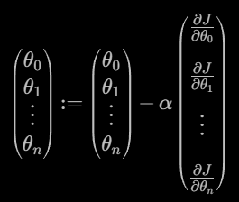

# テーブルデータを用いた教師あり学習のアルゴリズム

**重要：万能なアルゴリズムはない！**

* [線形モデル](#線形モデル)
    * 線形回帰
    * ロジスティック回帰
    * ※正則化
        * L1正則化
        * L2正則化
* 決定木ベースモデル
    * [決定木](#決定木)
    * [ランダムフォレスト](#ランダムフォレスト)
    * [勾配ブースティング三兄弟](#勾配ブースティング)
        * XGBoost：落ち着いてる長男
        * LightGBM：スピードスターの次男
        * CatBoost：個性的な三男
* 距離ベースモデル
    * k-NN
* 単純ベイズモデル
    * Naive Bayes

## 線形モデル

### 前提
データに最もフィットする重み（w）とバイアス（b）を見つけるのが学習。   
**バイアスも「常に入力値が1の特徴量の重み」と捉えることでわかりやすくなる。**

### 基本
| | **線形回帰** | **ロジスティック回帰** |
| :--- | :--- | :--- |
| **モデル** | $h = \mathbf{θ}^T \mathbf{x}$ | $p = \sigma(\mathbf{θ}^T \mathbf{x})$ |
| **損失関数** | $J = \frac{1}{2m} \sum (h - y)^2$ | $J = - \frac{1}{m} \sum [y \log(p) + (1-y)\log(1-p)]$ |
| **勾配** | $\frac{\partial J}{\partial θ_j} = \frac{1}{m} \sum (h - y) x_j$ | $\frac{\partial J}{\partial θ_j} = \frac{1}{m} \sum (p - y) x_j$ |

### モデルの用途
* 線形回帰：回帰  
* ロジスティック回帰：分類  
※ロジスティック回帰は、線形回帰の出力をシグモイド関数に通して変換したもの。回帰の結果を確率と捉え、分類に利用する。  

### モデルの幾何学的イメージ
* 線形回帰：直線をくるくる傾けながら上下に移動させてデータにフィットさせる
* ロジスティック回帰：S字カーブの急峻さをビヨンビヨン変えたり反転させながら左右に移動させてデータにフィットさせる

#### ロジスティック回帰のモデルについて
* 内部の線形グラフ（横軸：特徴量x, 縦軸：線形スコアz）※シグモイド関数に通す前の、線形回帰と同じ部分のグラフ。z = wx + b で表されるただの直線。
* 最終的なS字カーブ（横軸：特徴量x, 縦軸：確率p）

#### 内部の線形グラフのパラメーター操作による、S字グラフ連動の仕方のイメージ
1. 内部の線形グラフをくるくる回すと、S字グラフも連動してビヨンビヨン急峻さが変わる。右上がりか右下がりか変わるたびにS字グラフもパッと反転し、線形グラフと同じく右上がりか右下がりになる
1. 線形グラフを上下に動かすと、グラフと横軸が交わる点が左右に動く。ここが 決定境界を表しているため、連動してs字グラフは左右に動く。

### 損失関数
データへの「フィット感」を測る指標。これが小さいほど良い。  
「パラメータ+損失値」空間内のグラフ

#### デファクトスタンダードの損失関数
* 線形回帰の場合： 平均二乗誤差
* ロジスティック回帰の場合： 交差エントロピー誤差

どちらのグラフも下に凸の放物面であり唯一の最小値を持つので、勾配降下法で安心して底を目指せる。  
※平均二乗誤差の場合は正規方程式で一撃だが、特徴量の数が非常に多い（数万を超えるような）場合は勾配降下法の方がコスパがいい場合がある。
※ロジスティック回帰の交差エントロピー誤差の関数は必ず下に凸になるが、その最小値（最下部）がユニークな一点に定まるとは限らず、平坦な領域（面や線）になる場合がある。そのため正則化で最下点を作る。

### 交差エントロピー誤差（対数損失）とは？

データ1件あたりの損失関数

$$ L_{CE}(p, y) = - [ y \log(p) + (1-y) \log(1-p) ] $$

*   $y=1$ のとき、第2項は消えて $- \log(p)$ となる。
*   $y=0$ のとき、第1項は消えて $- \log(1-p)$ となる。

つまり、予測値が正解からかけ離れるほど損失値は急激に跳ね上がる  
すべての訓練データ（m件）に対する全体の損失関数は、これらの平均を取ったもの。  

交差エントロピー誤差の損失関数Jをパラメータで偏微分すると、シグモイド関数の微分の性質によって多くの項が打ち消し合い、結果的に線形回帰とそっくりな勾配の式が現れる。

### 類似性
ラッキーなことに、線形回帰とロジスティック回帰の勾配の統一式は、構造がほとんど同じ。  
両方とも、(予測値－正解ラベル)×特徴量、という項を全データについて平均している。  
唯一の違いは「予測値」の計算方法。  

### 勾配降下法
損失曲面の現在地から、その真下にあるパラメータ空間上で、「最も急な上り坂の方向」と「傾きの大きさ」を表す「勾配ベクトル」を計算する。  
この勾配ベクトルは上り坂の方向を指しているので、その真逆の方向に進めば、損失曲面の坂を下ることができる。つまり進むべき移動方向はその真逆、勾配ベクトルに-1をかけた負の勾配ベクトル。  
移動距離（パラメータの更新量）は、勾配ベクトルの「傾きの大きさ」を元に決める。「傾き」の情報と「移動距離」の情報は本来別物だが、「学習率」という係数を掛けて調整(翻訳)し、そのまま現在のパラメータに足し合わせてしまう。  
少々トリッキーなアプローチだが、このプロセスを何度も繰り返して少しずつ損失関数の谷底（最適解）に近づいていくのが勾配降下法だ。

#### パラメータ更新の式
$$
\boldsymbol{\theta} := \boldsymbol{\theta} - \alpha \nabla J(\boldsymbol{\theta})
$$
※わかりやすく

### L1L2正則化
実務においてはほぼ必須の標準装備

バイアス項（切片 θ0）は正則化の対象から外すのが一般的。これは、切片はモデル全体の底上げを調整する役割であり、その大きさを罰するべきではない、という考え方に基づいている。
もし、より実践的な形にするなら、ペナルティ計算を alpha * (np.abs(T1)) や alpha * (T1**2) のように重み θ1 のみに適用します。

新しい曲面には、元のピラミッドが持っていた鋭い「折れ目」が残ります。
最小値: この新しい曲面で最も低い点（最小値）を探すと、その滑らかな底の部分ではなく、折れ目の谷底のどこかに落ち着く可能性が高くなります。そして、その折れ目上では、いずれかのパラメータが0になっています。
結論：「折れ目が強く深くなる」
そして、「正則化が強いほど折れ目が強く深くなる」というご意見も正しいです。
正則化項にかかる係数λを大きくすることは、曲面で言えば「逆ピラミッドをより急峻（steep）にする」ことに相当します。

L1正則化とはつまり、原点を中心とした逆ピラミッドグラフで、損失曲面グラフを押し上げる操作である
この時、損失曲面グラフには逆ピラミッドの稜線に沿って軽い折り目のような溝ができる。※L1正則化が強いほど溝は深くなる
グラフの最小値(の近似)を求めるとき、この溝のどこかになる可能性が高い。※その可能性はL1正則化が強いほど高くなる。溝が深いから。
そしてその溝のどこかとは、θ0かθ1軸上になるため、特定のパラメータが0になる

超簡単に表現すれば、なだらかな局面に折れ目のような溝があると、小さい球を転がしたときにその溝に「スポッツ」とはまりやすくなるイメージ。溝が深いほどはまりやすくなる

L1正則化項（逆ピラミッド）が損失関数に加わることで、損失曲面に「谷」ができる。
谷は逆ピラミッドの稜線（θ0軸やθ1軸）に沿って形成され、正則化が強いほど谷は深くなる。
最適解は谷底のどこか（特に軸上）になりやすく、結果として特定のパラメータが0になる。

正しいポイント
幾何学的な解釈：L1正則化項は確かに原点を中心とした「ダイヤモンド形」（逆ピラミッド）の等高線を持ち、損失曲面に「角」を作ります。この角が軸上（パラメータが0になる点）に最適解を誘導します。

スパース性の起源：最適解が角（稜線）に位置しやすいため、一部のパラメータが0になります。

最適解は必ずしも厳密に軸上になるわけではありませんが、正則化が強いほど高い確率で軸上（スパースな解）になります。

「なだらかな斜面に鋭い溝（折れ目）があり、小さい球が溝にスポッとはまりやすくなる」 という表現は、L1正則化の振る舞いを非常に直感的に捉えています。

3. ご自身のイメージとの対応
「原点を中心とした逆ピラミッドグラフで、損失曲面グラフを押し上げる操作」: これは「損失関数＋L1正則化項」という新しい損失関数を考えることに対応します。L1正則化項の形は、原点で尖った逆ピラミッド（4角錐）のような形をしているため、このイメージは非常に的確です。[12]
「逆ピラミッドの稜線に沿って軽い折り目のような谷ができる」: 正しいです。新しい損失関数は、元の滑らかなお椀状のグラフに、軸上で尖った谷（微分不可能な点）を持つ形になります。[12]
「グラフの最小値は、この谷底のどこかになる可能性が高い」: その通りです。最適化の過程で、解はこの鋭い谷に「滑り落ち」やすくなります。
「谷底のどこかとはつまり、θ0軸上かθ1軸上であるため、特定のパラメータが0になる」: これが結論です。谷底が軸上にあるため、その点の座標、つまりパラメータのどちらかが0になります。

とりあえず初手エラスティックネット

損失関数 + alpha * (l1_ratio * L1ペナルティ + (1-l1_ratio) * L2ペナルティ)

2つのパラメータ
* alpha
    * 正則化項全体の強さをコントロールするハイパーパラメータ
* l1_ratio
    * ペナルティの「質」を決めるミキシングダイヤル
    * 1だとラッソ回帰と全く同じ、0だとリッジ回帰と全く同じ
    * 0 < l1_ratio < 1だとL1とL2の両方を混ぜて使う。例えばl1_ratio=0.5なら、L1とL2のペナルティを半々で加える。
    * 探索候補に0や1を含め、最適な正則化手法そのものをデータドリブンで見つける

線形モデルの特徴量スケーリング

線形モデルの特徴量スケーリングについて質問です
以下の理解は正しいですか？
線形モデルは特徴量とパラメータを掛け合わせた値で予測をするが、最終的にはそれらを全データ分足し合わせるため、特徴量同士の割合(スケール)がバラバラだと、各特徴量ごとのパラメータが持つ影響力もバラバラになってしまう。それを防ぐために特徴量のスケールをそろえる

はい、その理解はほぼ正しいです。非常に良い着眼点だと思います。

その素晴らしい理解を、もう少し専門的な言葉で補強し、いくつかの重要なポイントを付け加えると、さらに理解が深まります。

ユーザーさんの理解の要約と補足

ユーザーさんの理解:
「線形モデルは特徴量とパラメータを掛け合わせて予測し、それらを足し合わせる。特徴量のスケールがバラバラだと、各パラメータが持つ影響力もバラバラになる。それを防ぐためにスケーリングする。」

この「パラメータが持つ影響力」という部分が重要です。もう少し具体的に言うと、影響力がバラバラになることで、主に以下の2つの問題が発生します。

なぜスケーリングが必要か？より詳しい理由
1. 学習（最適化）の効率が著しく低下するため（勾配降下法への影響）

線形モデルは、予測値と正解値の誤差（コスト関数）が最小になるようなパラメータ（重み）を見つけることで学習します。この探索には勾配降下法という手法がよく使われます。

スケールが揃っていない場合:

コスト関数のグラフが、下図のように**歪んだ楕円形（お椀型）**になります。

勾配（傾き）が急な方向と緩やかな方向ができてしまい、最小値に向かってまっすぐ進むことができません。

そのため、ジグザグに進むような非効率な探索となり、学習に時間がかかったり、最適解にたどり着けなかったりします。

(Credit: Andrew Ng's Machine Learning course)

スケールを揃えた場合:

コスト関数のグラフが真円に近い形になります。

どの方向からでも、傾きは最短で中心（最小値）を指すようになります。

これにより、勾配降下法はスムーズかつ高速に最適解へ収束できます。

つまり、スケーリングは学習アルゴリズムを助け、より速く、より安定して最適なパラメータを見つけるために不可欠です。

2. 正則化の効果が正しく得られないため

Ridge回帰やLasso回帰、ElasticNetのように、パラメータが大きくなりすぎることを防ぐ正則化を用いる線形モデルでは、スケーリングは特に重要です。

正則化は、パラメータ（重み）の大きさ自体にペナルティを課します。

Ridge (L2正則化): パラメータの二乗和にペナルティ

Lasso (L1正則化): パラメータの絶対値和にペナルティ

ここで、例えば「家の価格予測」を考えてみましょう。

特徴量1: 面積 (例: 50〜200 m²)

特徴量2: 部屋数 (例: 1〜5部屋)

面積のスケールは部屋数よりずっと大きいですね。この場合、モデルが同じくらいの影響を予測値に与えるためには、面積に対応するパラメータは非常に小さく、部屋数に対応するパラメータは比較的大きくなる傾向があります。

正則化は、この背景を考慮せず、単純にパラメータの「値の大きさ」だけでペナルティを計算します。

その結果、本来は重要な特徴量であるはずの「部屋数」のパラメータが、値が大きいというだけで過剰にペナルティを受けてしまい、不当に小さく見積もられてしまう可能性があります。

スケーリングを行うことで、全ての特徴量を同じ土俵に乗せ、正則化が公平に機能するようにできます。

まとめ

ユーザーさんのご認識は「パラメータの解釈性」や「モデル内での影響力」という観点で正しく、それを技術的な背景で補強すると以下のようになります。

学習の高速化・安定化: 勾配降下法が効率的に動作し、最適解に速くたどり着ける。

正則化の適正化: パラメータへのペナルティが、特徴量のスケールに左右されず、公平に適用される。

パラメータの比較可能性: 学習後のパラメータの大きさを見比べることで、どの特徴量が予測に大きく寄与しているかを（ある程度）直接的に比較できるようになる。

したがって、「特徴量のスケールをそろえる」という前処理は、特に勾配降下法や正則化を用いる多くの線形モデルにおいて、非常に重要なステップと言えます。

## 決定木

回帰と分類の両方に使える

各特徴量を軸とする特徴量空間を、任意の一つの特徴量に対する真偽条件のif分岐で二分割していく。最終的な分割領域一つにつき一つの予測値を返す。

その予測値は、学習時にその領域に含まれている全データの多数派の値(分類のケース)、もしくは平均値(回帰のケース)。

分割は、等号、不等号による真偽値だけで判断するため、事前に特徴量の単位を揃える「スケーリング（標準化や正規化）」が基本的に不要。二値特徴量と連続値特徴量が混在していても問題ない。

決定木が「なぜその予測をしたのか？」を解釈、説明するのは非常に簡単で、たどったif文のルートをそのまま説明すればいい。

決定木というアルゴリズムは賢いので、全ての分割の可能性を不純度などの数学的な指標で評価し、最も情報量が多く、データを綺麗に分けられる質問（if分岐）を自動的に選択する。

## ランダムフォレスト

### 概要
* 沢山の「個性が違う決定木」をたくさん作り、最終的に多数決（分類の場合）や平均（回帰の場合）で決める
* 決定木の作成時には、ブートストラップサンプリングで新しいデータセットが作成される。
* 分割時には毎回ランダムに特徴量のサブセットが選ばれ、使われる
* 多数決や平均をとることで、個々の木の予測の不安定さを打ち消し、安定した予測を得る。  

### 主要なハイパーパラメータ

#### n_estimators
構築する決定木の数

一般的に、この値は大きいほど良い。モデルの性能が安定し、過学習しにくくなる。ただし、ある一定数を超えると性能向上は頭打ちになり、計算時間だけが増えていく。まずは100程度から始め、必要に応じて増やすのが一般的。

#### max_features
使用する特徴量の数  
各決定木が分岐（ノードを分割）する際に、候補としてランダムに選ぶ特徴量の最大数  
小さくすると、各決定木が使う特徴量がバラバラになり、木々の多様性が増す。これにより、モデル全体の汎化性能が向上する傾向がある。  
大きくする (全特徴量数に近づける)と、各決定木が似通ったものになり、モデル全体の性能が低下する可能性がある（特に特徴量間に相関が強い場合）。  

一般的な設定値:  
分類問題: sqrt(全特徴量数) （全特徴量数の平方根）  
回帰問題: 全特徴量数 / 3  

#### max_depth
木の最大の深さ  
各決定木の最大の深さを制限する。  
深すぎるとモデルが複雑になり過学習しやすくなるが、浅すぎるとモデルが単純になり学習不足になる可能性がありる。  
デフォルト（制限なし）だと、ノードが純粋になるまで木が成長するため、過学習のリスクがある。この値を適切に設定することで、モデルの複雑さをコントロールできる。  

### その他の重要なパラメータ

#### min_samples_split
ノードを分割するために必要な最小サンプル数。これを大きくすると、より一般的な（過学習しにくい）モデルになる。
#### min_samples_leaf
葉ノード（末端のノード）に存在しなければならない最小サンプル数。これも過学習を防ぐために使われる。
#### bootstrap
データをサンプリングする際に、復元抽出（同じサンプルを複数回選ぶことを許可する）を行うかどうか。Trueがデフォルトで、これがランダムフォレストの「バギング」という手法の根幹をなす。

実際にモデルを構築する際は、これらのパラメータをグリッドサーチやランダムサーチといった手法と**交差検証（クロスバリデーション）**を組み合わせて、データに最適な値を見つけ出すのが一般的です。

## 勾配ブースティング

* 沢山の小さな決定木をつくり組み合わせる  
* 新しいモデルは、前のモデルの予測と実際の値との残差(損失関数の勾配)を予測するように学習  
* 各モデルの結果を足し合わせる  

[ゼロから始める勾配ブースティング決定木の理論](https://zenn.dev/dalab/articles/9c843f0ec8aabf)

分類問題の場合、予測値空間の予測値が(0 < p < 1)の確率(p)となるので、勾配降下法やブースティングの加算がうまく機能しない。
確率pを直接パラメータとして更新しようとすると、境界（0と1）で問題が発生し、単純な加算・減算による更新ができない。
そのため、まず対数損失を損失関数L(y, p)とし、その上でp = sigmoid(F)と置き換える(pの関数を疑似的にFの関数に変換している)。
ブースティングの加算更新を可能にするために、足し算や引き算が自由にできない確率空間(0 < p < 1)内の損失曲面から、足し算や引き算が自由にできる対数オッズ空間(-∞ < F < +∞)内の損失曲面へ問題を移すためのテクニック。
対数損失とp = sigmoid(F)の組み合わせがよく使われる理由は二つ。まずシンプルに(0 < p < 1)の範囲を(-∞ < F < +∞)の範囲に対応させるため。そして勾配の計算が非常にシンプルになるから。

確率空間(0 < p < 1)内の対数損失のグラフはL = -log(p)であり、p=0で無限大に発散する、急な崖のような曲線。

では、Fの空間(対数オッズ空間)における損失の線グラフはどんな形か？

要するに対数損失の曲線を、0を中心に左右にはなれるほど変化をなだらかにしていくイメージですよね？シグモイド曲線の作用が加わるので。
そういう風に変化させたものが、例の滑りだということ？
対数損失のグラフの下に90度回転させたシグモイド曲線を並べて、-∞~+∞の変化が0~1の変化に対応し、対数損失を求めるというイメージで考えました。意味わかります？ｗ

2つのグラフを頭の中で連携させている

シグモイド曲線
横軸:  対数オッズ F (-∞ ~ +∞)
縦軸: 確率 p (0 ~ 1)
形状: 横にしたS字カーブ。
p=0.5 のとき F=0
pが1に近づくと、Fは +∞ に向かって急激に伸びる。
pが0に近づくと、Fは -∞ に向かって急激に伸びる。

確率 p (0 ~ 1)を対応させる

十等分イメージで！
あなたのイメージは、なぜ「p空間の急な崖」が「F空間のなだらかな滑り台」になるのか、その変換（マッピング）の過程を見事に説明しています。
崖が坂道になる理由: pが0に近づく領域は、Fのスケールでは極端に引き伸ばされます。そのため、p空間では垂直に見えた崖が、F空間では有限の傾きを持つ直線的な坂道になるのです。
ゴールが平らになる理由: pが1に近づく領域も、Fのスケールでは極端に引き伸ばされます。そのため、p空間でもともとなだらかだった曲線が、F空間ではさらに引き伸ばされて、ほぼ平らに見えるのです。

回帰 (損失関数が平均二乗誤差 MSE の場合):
損失関数
Loss(c) = Σ (y_i - c)^2
を最小化する定数 c を求める。
c で偏微分して 0 とおく。
最適な定数 c は ターゲット変数 y の平均値 となる。

分類 (損失関数が対数損失 LogLoss の場合):
損失関数
Loss(c) = - Σ [ y_i * log(p) + (1 - y_i) * log(1 - p) ]
を最小化する定数 c を求める。
c で偏微分して 0 とおく。
最適な定数 c は、クラス1の出現確率の対数オッズ となる。
例えば、クラス1が70%、クラス0が30%なら、log(0.7 / (1 - 0.7)) が初期値となる

ここの偏微分して0とおく操作は、シンプルに損失曲面の最小値を求めているだけ。

確率 p → [ロジット関数] → 対数オッズ x
対数オッズ x → [シグモイド関数] → 確率 p

勾配ブースティングは「損失関数」「リンク関数」「弱学習器」という3つの構成要素(モジュール)をプラグインのように差し替えできる汎用的なフレームワークアルゴリズム。

### 主な選択肢
* 損失関数(基本的に凸関数（下に凸）)
    * 二乗誤差 (MSE): (y - F)² → 標準的な回帰
    * 対数損失 (LogLoss): log(1 + exp(-yF)) → 分類（yは-1, 1）
* リンク関数(これは通常、損失関数の選択と密接に関連する。)
    * 恒等関数 (ŷ = F): F をそのまま予測値とする。MSEで使われる。
    * シグモイド関数 (ŷ = sigmoid(F)): F を対数オッズとみなし、確率に戻す。対数損失で使われる。
* 弱学習器
    * 決定木: ほぼ全てのケースで使われる最も強力な選択肢。

---------

推奨トピック（タグ）：
MachineLearning, AI, Python, 数学, DataScience, 初心者向け

# 勾配ブースティング(GBDT)をイメージで理解する

XGBoostやLightGBMのコアとなる考え方を、直感的なイメージを優先し、できるだけわかりやすく解説する。

## 前提
GBDTでは、「損失関数」「最適化手法」「学習器」という3つのスロットを自由に差し替え可能。
仕組みはシンプル。
まず損失の形状を損失関数で定義し、その損失が最も減少する更新量（方向と大きさ）を最適化手法で計算。
それを学習器で近似して足し合わせていくだけ。
各スロットはモジュールのように独立している。
損失関数：2階微分可能かつ下に凸であれば何でもよい（ニュートン法を使う場合）。
最適化手法：基本の勾配降下法もあるが、高速・高精度なニュートン法（2階微分の利用）が現在の主流。
学習器：線形モデルやニューラルネットも利用可能だが、テーブルデータにおいては決定木がデファクトスタンダード。
つまり現代の実装において最適化手法と学習器はほぼ固定されており、選定の余地があるのは実質「損失関数」のみ。

## 概要

データの姿
特徴量空間の中に、たくさんのデータ点が散らばっている。
各データ点は正解値を持っており、それを予測するのが目的。
つまり、空間内における各点の配置位置と正解値の関連性を学習する

損失の計算
対となる予測値`f`と正解値`y`のペアから損失`l`を計算する関数`l = ℓ(f, y)`を用意する。
この関数はすべてのデータ点に適用されるが、各点の正解値は固定なので、実質的には各点が「予測値を入力すると損失が出力される独自の線グラフ`l = ℓ(f)`」を持っていると見なせる。
関数`ℓ`は、この線グラフが下に凸の曲線になるように設計する(横軸を予測値、縦軸を損失としたとき)。
最終的な目的は、すべてのデータ点の損失`l`を足し合わせた「全体の損失」を最小化すること。
この全体の損失`L`を求める式`L = Σ_i ℓ(f_i, y_i)`がGBDTにおける損失関数となる。

学習の流れ
□初期化
まず、すべてのデータ点に同じ予測値（初期値）を設定する。
□ステップ1：曲線の近似
各データ点の損失曲線を、現在の予測値の位置を基準に2次放物線で近似する。これは、予測値をどの方向にどれだけ更新すれば最も効率よく損失を減らせるかを見積もるため。
この時点で、各データ点は自分専用の近似放物線を持っている状態になる。
□ステップ2：決定木の作成
次に、浅い決定木を作成する。この木の役割は次の2つ。
データ点を、似た特性を持つグループに分けるように分割する
分割後の各グループに対して、損失を最も効率よく減らせる更新量を出力する
この分割位置と出力値の決定に、近似放物線の情報が使われる。
これはGBDT特有のアプローチ。
□ステップ3：予測値の更新
作成した決定木の出力に学習率を掛けた値を、各データ点の現在の予測値に足して更新する。
□ステップ1～3の繰り返し
更新後の新しい予測値を基準に、再び近似放物線を作り直す。その後、新しい決定木を作り、予測値を更新する。
この流れを、設定した回数に達するか、損失の改善が十分に見られなくなるまで繰り返す。

完成したモデル
最終的なモデルは、次の2つの組み合わせで表現される。
初期予測値
学習によって作られた多数の決定木(※出力は学習率で調整される)

予測の実行
新しいデータを予測するときは、次の処理を行う。
特徴量空間の中に予測したいデータ点を配置する。
学習で作られたすべての決定木を適用し、「初期予測値」と「各決定木の出力」をすべて足し合わせる。
この合計値が最終的な予測値となる。

過学習を防ぐ
木の複雑さの制限、正則化、Early Stoppingなどのテクニックがある。

## 詳細

### 損失の計算：損失関数とは何か
損失関数とは、ビジネス上のドメインロジックを数式に翻訳したもの。
「何を達成したいか？」「どういう間違え方が一番ダメで、どういう間違え方なら許容できるか？」という価値観そのものと言える。
ここを変えるだけで、モデルは「売上予測機」にも「スパム判定機」にもなる。
実装の上では「正解値と予測値の誤差に対して、どのような性質のペナルティ(損失)を与えるか」を定義することであり、モデルはそのペナルティの総和を最小化する計算機に過ぎない。

### 損失の計算:損失関数の基本形
#### 数式
`L = Σ_i ℓ(f_i, y_i)`
#### 数式の構成要素
`L`：最終的な総損失
`ℓ`：損失の定義（各データに対する損失を計算する関数）
`f_i`：データ`i`における予測値
`y_i`：データ`i`における正解値

### 損失の計算：損失関数の幾何学的イメージ
基本構造
・学習に使う全データ`i = 1, 2, ..., n`それぞれに対して、完全に独立した2次元平面が存在する
・各平面は「そのデータ専用の予測値軸`f_i`」と「損失軸」で構成される
・各平面上に「下に凸な曲線グラフ」が一つずつ描かれている
・この曲線は予測値`f_i`を受け取り、損失値`ℓ(f_i, y_i)`を返す関数のグラフである
・各データの正解値`y_i`が異なるため、曲線の最小値の位置も異なる
・これらn個の平面は幾何学的に別物であり、互いに干渉しない
総損失の計算
・各平面上の曲線が出力した損失値をすべて足し合わせた値が総損失`L`となる
・これが前述の式`L = Σ_i ℓ(f_i, y_i)`の意味

### 損失の計算：損失関数の設計
損失関数は自由に設計できるが、ニュートン法を扱うには以下の条件を満たす必要がある。
1.2階微分可能であること（勾配`g`と曲率`h`を計算するため）
2.グラフが下に凸であること（つまり常に`h > 0`。これにより、どの予測値から始めても必ず谷底にたどり着ける）

オーソドックスなものは以下の2つ。`f`は予測値、`y`は正解値。

#### 二乗誤差(回帰用)
損失の定義：`ℓ(f, y) = 1/2 (f - y)^2`
※微分した形を簡単にするため`1/2`を掛けることが多い。

損失関数は`L = Σ_i 1/2 (f_i - y_i)^2`となる。

#### 対数損失(二値分類用)
損失の定義：`ℓ(f, y) = - y log(σ(f)) - (1 - y) log(1 - σ(f))`
※`f`は対数オッズ。損失計算ではシグモイド関数 σ(f) で確率に変換して使う。

損失関数は`L = Σ_i (- y_i log(σ(f_i)) - (1 - y_i) log(1 - σ(f_i)))`となる。

これらは回帰と分類における最も基本的な損失であり、ほとんどのケースに対応できる。
特殊なビジネス要件においては、これらをカスタムして使うこともある。例えば過小評価をより重く罰する非対称な損失など。

### 初期化：初期予測値の決定
まず最初に、予測の出発点となる初期値を決める。ここではすべてのデータに対して同じ値を当てはめることを考える。そしてそのときに損失の合計が最も小さくなる定数を探す。その値が最初の予測値となる。
通常、回帰の場合は全正解値の平均となり、二値分類の場合は全正解値の平均の対数オッズ(例えばデータが100個あって、1が70個、0が30個だった場合、平均0.7の対数オッズ※約0.847)となる。
この最初の予測値を全データに適用し、そこからの理想的な更新量を出力する決定木を作る。

### 曲線の近似：ニュートンステップ
損失関数の曲線上で、「予測値を次にどれくらい更新すれば最も損失を減らせるか」の目安が欲しい。
複雑な損失曲線のままでは計算が難しいため、現在の予測値の周辺において損失関数を二次関数（放物線）に近似して考える。
この近似には二次のテイラー展開を用いる。

ここでは現在地からの更新量`w`を用いて、損失の変化を`a w^2 + b w + c`という放物線で近似する。
現在地（更新量`w = 0`の地点）における情報を3つ（高さ`L`、傾き`g`、曲率`h`）持っているので、これで係数合わせをする。

近似放物線において
現在地の高さは、近似式`a w^2 + b w + c`に`w = 0`を代入して`c`となる。これが`L`に等しい(`c = L`)。
現在地の勾配は、1階導関数`2 a w + b`に`w = 0`を代入して`b`となる。これが`g`に等しい(`b = g`)。
現在地の曲率は、2階導関数`2 a`(定数)となる。これが`h`に等しい。つまり`a = 1/2 h`。
これらを代入すると近似式は`1/2 h w^2 + g w + L`となる。
ただし、ここで考えるのは「現時点からどのくらい損失を減らせるか」のみなので、現時点での損失`L`は考慮する必要がない。
したがって、最終的な近似式(放物線)は`1/2 h w^2 + g w`となる。

この放物線は谷底で最小値をとるので、その位置までの更新量`w`を求める。
谷底では傾きが0になるため、式を`w`で微分して`0`とおくと`h w + g = 0`
つまり`w = - g / h`
この`w`が「近似した放物線における最も損失が減る更新量」であり「真の損失関数における更新量の最適な目安」となる。これをニュートンステップと呼ぶ。

ちなみに、式 `w = - g / h` の意味を別の角度から捉えると、曲率 `h` の重要な役割が見えてくる。
曲率が大きい（`h`が大きい）ということは谷が急であることを意味するので、少し進んだだけで損失が急激に下がる一方、行き過ぎると反対側の坂を登ってしまう危険がある。
式`w = - g / h`に注目すると、曲率`h`が分母にあるため、`h`が大きいほど更新量`w`は小さく抑えられることがわかる。
つまり曲率`h`は各データ点の地形の険しさを測り、それに応じて最適な歩幅を自動調整する賢いブレーキとして機能している。
この自動調整ブレーキの仕組みにより、ニュートン法は単純な勾配降下法よりも効率的に、しかも安全に最適解に近づくことができる。

### 曲線の近似：g(勾配)とh(曲率)について
回帰や分類の標準的なGBDTにおいて、損失関数`L = Σ_i ℓ(f_i, y_i)`で足し合わせる各項には1つの予測値しか含まれない。
つまり任意の予測値で偏微分して勾配を求めるとき、その予測値が含まれる1つの項以外はすべて定数扱いとなり消える。そして勾配に含まれる予測値は1つのみとなる。
勾配式の変数が1つのみということは、勾配を線グラフ（2次元のグラフ）で表せるということであり、その勾配の勾配(つまり曲率)はスカラーで表せるということ。このスカラー値が曲率。

補足：
線形回帰やロジスティック回帰の場合は損失関数がパラメータ空間内にある。つまり「損失関数で足し合わせる各項には1つの予測値しか含まれない」のはGBDTと同じでも、「その一つの予測値を決めるために全パラメータが使われる」ため、偏微分しても勾配式が多変数(曲面)のままとなり、曲率は行列になる。
またランキング学習のような特殊なGBDTにおいても勾配式が多変数(曲面)となるが、曲率については「対角成分だけで近似する(自身の軸のみ考慮)」あるいは「上界を取る(安全策)」というテクニックを使って、無理やり独立したスカラーとして扱える形式に落とし込む。

### 曲線の近似：各データ点の状況
特徴量空間の中に各データ点`i`があり、全ての`i`は独自の正解値`y_i`とその時点での予測値`f_i`を持っている。
各データ`i`の損失関数をテイラー展開（2次近似）し、全ての`i`が「自分専用の小さな近似放物線」を持っている様子をイメージする。これらの放物線はそれぞれの`i`専用の予測値空間(2次元平面)内にある。
近似した二次関数は現在地からの更新量`w`と損失の変化`l`を用いて 
`l = 1/2 h w^2 + g w`と表せる。
これらの放物線を決定木で分割しながら、全体の損失を最大限減らすことができる理想的な更新量を探っていく。

### 決定木の作成：回帰と二値分類の違いについて
回帰でも二値分類でも予測には回帰木を使用し、各データの予測値を少しずつ更新していくというアプローチをとる。
ただ二値分類の場合は予測値が確率であり、そのままでは足し合わせることができない(確率は0から1の範囲に収まる必要があるため、そのまま足し合わせると範囲を突き抜けてしまう)。
そこで、その確率を対数オッズに変換したものを疑似的な予測値として扱う。
最終的に最適な予測値(対数オッズ)を求めたら、それをシグモイド関数で再変換して確率に戻す。

### 決定木の作成：特別な決定木
GBDTにおいて、決定木が全体の放物線を2グループに分ける基準はとてもユニークで合理的。
まず、2分割した各グループ内の放物線を1つに合算し、巨大な放物線を作るイメージを持つ。
つまり各グループ内に1つずつ、計2つの巨大放物線が出来上がる。
そしてその2つの巨大放物線の谷底の深さ(現在地からの損失の減少)の合計が最も深くなる分割を探す。
最善の分割を見つけたら、その損失減少の合計が「分割前の全ての放物線を合体させた、1つの巨大放物線の谷底の深さ(損失減少)」よりどれだけ大きくなったか？を算出する。この差分はGain（利得）と呼ばれ、分割によってどれだけ損失の減少をより大きくできたか？を表す。もしこのGainが小さすぎる場合は、木を複雑にするコストに見合わないと判断して分割を行わない。
この分割基準は従来の決定木とは根本的に異なり、損失の減少量そのものを対象にしている。言わばGBDTのために特別に設計された決定木であり、損失をどれだけ直接減らせるかという最も純粋な基準で木を成長させる。

### 決定木の作成：決定木がやっていること
では具体的に「最善の分割」や「更新値」はどうやって計算されるのか？その仕組みを紐解いてみる。
まず分割した2つの葉それぞれについて、最適な更新量をひとつずつ割り出す。
最適な更新量とは、同じ葉に含まれる全放物線の損失変化の和`Σ_i l_i`を最小にできる値である。
`Σ_i l_i`は
データ`i`における損失変化`l_i`を`1/2 h_i w^2 + g_i w`とすると、
`Σ_i (1/2 h_i w^2 + g_i w)`と表せる。
この式は「個別の放物線`1/2 h w^2 + g w`をすべて足し合わせた1つの巨大な放物線」と見ることもできる。

分かりやすく`1/2 Σ_i h_i w^2 + Σ_i g_i w`と変形し、`G = Σ_i g_i`、`​H = Σ_i h_i`とおくと`1/2 H w^2 + G w`。

つまり`Σ_i l_i`とはこの巨大放物線の値そのものであり、その値が最小になる更新値`w`とはまさにこの巨大放物線のニュートンステップ`w = - G / H`である。
そのニュートンステップを巨大放物線`1/2 H w^2 + G w`に代入した
`1/2 H (- G / H)^2 + G (- G / H)`
`= 1/2 G^2 / H - G^2 / H`
`= - 1/2 G^2 / H`
が`Σ_i l_i`の最小値。

`G^2 / H`の値が大きいほど損失がたくさん減ることが分かるので、できるだけ`G^2`の値を大きく、`H`の値を小さくすることを考える。

#### まず`G^2`の値を最大化するため、`G`の絶対値を大きくする。

2つの葉それぞれの`G = Σ_i g_i`の絶対値を大きくするとはつまり、`g`をできるだけ「プラスチーム」と「マイナスチーム」がきれいに分かれるように2分割したいということ。`g`の合計が相殺されないように分ける。

この相殺を幾何学的なイメージで捉えてみる。`g`がプラスの放物線は、谷底が現在地より左側にある。逆に`g`がマイナスの放物線は、谷底が現在地より右側にある。その2つの放物線を現在地を基準にして重ね合わせた時、片方のグラフが谷底になる地点では、もう片方のグラフは現在地の基準線0よりも高い位置（プラスの領域）にある。そのため、この2つの放物線を足し合わせると、互いの谷底の深さを打ち消し合うように全体が持ち上げられ、合体後の谷底は浅くなってしまう。これはつまり、損失を減らす力が相殺されてしまったということを意味する。

※ここに2つの放物線が原点で重なったグラフ

#### そしてHの値は小さくしたい。
`h > 0`となる損失関数を選択しているので、`H > 0`。`1 / H`という反比例のグラフの性質を考えると、分母の`H`が小さくなればなるほど値は急激に増えるため、全体からできるだけ少数の精鋭（`h`が小さい集団）を切り出す2分割をしたいということになる。

「勾配`g`が同じとき、曲率 `h`が小さいほど谷底までは深くなる」という性質を幾何学的なイメージで捉えてみる。
直感的には分かりにくいかもしれないが、核心となるイメージは「坂が緩やかなほど、より高い位置にならなければ勾配は大きくならない」というもの。
ここでは分かりやすいように、放物線 `y = 1/2 h w^2` の右側(`w > 0`)の坂を使って考える（左側でも理屈は同じ）。
曲線上で適当な点を選び、原点からその点へ直線を引く。
このとき、引いた直線の傾きは選んだ点での接線の傾き(勾配`g`)の半分になる。
これは以下の2つの傾きの比を見れば明らか
原点から引いた直線の傾き： `y / w = 1/2 h w`
選んだ点での接線の傾き： `g = dy / dw = h w`
この直線を式で整理して表すと `y = 1/2 g w` となる。
これは、同じ`g`を持つ点へ引く直線は全て同じものになるということ。
つまり放物線の曲率(緩やかさ)に関わらず、同じ勾配を持つ点は全て一直線上に並んでいる。
`w > 0`,`h > 0`なので`g > 0`、つまりこの直線は右上がり。
曲率`h`が小さい緩やかな放物線ほど、この直線と交わる点の位置が右上になるので、同じ`g`を持つ点の`w`(距離)と`y`(高さ、つまり損失の減少量)が大きくなる。

※ここに複数の放物線を直線が貫くグラフ

次に曲率の制限について考える

極端に曲率が小さいと損失は爆発的に減少するが、そういったケースはたまたまの外れ値である可能性が高く、そこに過剰に合わせに行くことは典型的な過学習の原因になる。
そこで、以下の2つの対策をとる。

1.「`H`が小さすぎる分割」を禁止するために`H`の最小値をパラメータで定めておく
2.巨大放物線`1/2 H w^2 + G w`にL2正則化項`1/2 λ w^2`を追加で足し合わせる(λは正則化パラメータ)。
数式では`1/2 H w^2 + G w + 1/2 λ w^2 = 1/2 (H + λ) w^2 + G w`
最小値は`- 1/2 G^2 / (H + λ)`となる。分母に正則化パラメータが加わることで分母が0に近づくのを防げるため、計算結果が爆発するのを回避できる。
幾何学的イメージでは、「極端に深く大きくなってしまった巨大放物線」に「現在地を頂点とするL2正則化放物線」を二次関数的な急ブレーキ役として足し合わせ、極端な更新量を現在地方向に強く引き戻す。
※後述の学習率でも「更新量を一律で0.1倍にする」ような線形のブレーキをかけるが、更新量が無限大や1兆になってしまったら、0.1倍してもまだデカすぎて制御不能になる。L2正則化は、分母に`+λ`することで、そもそも更新量が異常な値になることを構造的に防ぐブレーキ。

### 決定木の作成：更新量の決定
分割が見つかったら、それぞれの巨大放物線のニュートンステップ(つまり最適な更新量`w`)を葉の値とする。この葉の値が決定木の出力となる。
これを定められた木の深さまで繰り返し、決定木を完成させる。

### 完成したモデル：最終的な予測モデルの姿
「初期値」と「学習率で重みを調整された各決定木の出力」を単純にすべて足し合わせたものが最終的な予測値となる。
#### 数式
`y_hat = F_0 + Σ_m η f_m`
#### 数式の構成要素
`y_hat`：最終的な予測値
`F_0`：初期値（定数）。予測のベースライン。
`η`：学習率(`0 < η ≦ 1`)。
`f_m`：各決定木の出力。

### 過学習を防ぐ：木の深さ
1本1本の木は浅く保つようにする。木を深くしすぎると、細かいデータまで正確に分けすぎてしまうため。あえて浅くして解像度を下げることで、細部に潜むノイズをぼかし、全体の大まかな特徴（シグナル）だけを捉えられるようにする。

### 過学習を防ぐ：木の強さ
ニュートンステップは近似手法として優秀すぎるため、二乗誤差なら一発で底を特定し、対数損失でも数回でほぼ最深部に到達してしまう。
しかし、正解値という「ある特定のケースの結果」にモデルを過剰に適合させるべきではない。なぜなら、正解値には「普遍的なルール(シグナル)」だけでなく「特定のケースにしか発生しない偶然(ノイズ)」も含まれているから。
そこでノイズまで取り込まないように、1本1本の木の出力(実際の更新量)を意図的に抑える。優秀すぎる歩幅にあえてブレーキをかけながら進むイメージ。そのために使うブレーキ係数が学習率。基本的に学習率には一定の定数を用いる。
※ちなみにニュートンステップは予測値`y`の更新量そのものなので、`y`と単位は同じになる。これにより、単純な勾配降下法のように学習率が「単位を合わせる変換係数」の役割を担う必要がない。

### 過学習を防ぐ：木の多さ
予測値を更新しても精度が向上しないという現象が一定回数続いた場合、そこで学習を打ち切る(Early Stopping)。モデルが「意味のある法則」をほとんど学び終えたサインであり、それ以上木を増やし続けると単なる偶然や入力ミスのような「意味のない法則」を無理やり学び始めてしまう。
※「木の強さ」と「木の多さ」はシーソーの関係にある。学習率で強くブレーキをかけるほどゴールまで進むのにたくさんの木が必要になる。ブレーキを弱めると少ない木でゴールに着いてしまう。一般的に「学習率を小さくして、その分たっぷりと木の本数を用意し、Early Stoppingで最適な場所で止める」のが、最も精度が出やすい定石。

### 過学習を防ぐ：L1正則化
L1正則化を使うと不要な重みを完全に0にしてモデルを簡略化できる。ただL2正則化に比べると補助的に使われることが多いため、今回は割愛。

===

説明可能性（XAI）: なぜモデルがそのような予測をしたのかを説明する技術です。SHAPやLIMEといったライブラリを使えるようになると、ビジネスサイドへの説明能力が格段に上がり、信頼を得やすくなります。

その通りです！ 完璧な理解です。
ここで扱っているのは「損失の変化量（gain/loss change）」のグラフなので、基準となる現在地（
x
=
0
x=0
）の高さは 
0
0
（ゼロ） です。
それを踏まえて、二つのグラフの特徴を整理するとこうなります。
データの放物線（元グラフ）
谷底の深さ： マイナス（負の値）
理由：現在地（高さ0）から、勾配に従って坂を転がり落ちていくので、谷底は必ず地面（0）より低い「地下」にあります。
意味：損失が減る（改善する）。
正則化の放物線（L2）
谷底の深さ： ゼロ（0）
理由：式が 
1
2
λ
x
2
2
1
​
 λx 
2
 
 なので、必ず0以上の値になります。頂点は原点 
(
0
,
0
)
(0,0)
 です。
意味：損失は減らない（コストだけがかかる）。
合体させるとどうなるか？（足し算のイメージ）
この二つを足し合わせるということは、
「地下（マイナス）にあるデータの谷底」 を、「地上（ゼロ以上）にある正則化のグラフ」 が上に引っ張り上げる、という構図になります

=====
線形回帰とロジスティック回帰について
以下の理解は正しい？
ロジスティック回帰の基礎は線形回帰と同じ
予測値を0~1の範囲に収めるために線形モデルの出力をシグモイド関数に通す。さらに予測値と正解値の差を負の対数にし、大きなずれには重い損失を課す。
各パラメーターで偏微分し、勾配下降法を使う。
線形回帰の場合は、パラメーター数が少なければ連立方程式のほうが簡単に解ける場合も

曲率が行列になる
計算コストが高い
メモリを食う

*「連立方程式（正規方程式）を解くこと」と、線形回帰でニュートンステップを踏むことは、数学的に全く同じ計算

実務上の「スタンダード」は？

線形回帰
ニュートン法
勾配降下法

ロジスティック回帰
ニュートン法
準ニュートン法
勾配降下法

結論： 全てのパラメーターが複雑に絡み合っているため、それらの「全ての組み合わせ（行列）」を真面目に計算しないと、正しい方向に進めないのです。

GBDT： 100個の独立した「2次元の線グラフ」。（並列・バラバラ）
線形回帰系： 100枚の「多次元の曲面」が、同じ場所に重なってできた1つの複雑な地形。（重畳・密結合）

勾配ブースティングの仕組み

データの配置と目標
特徴量空間の中に、たくさんのデータ点が散らばっている。
各データ点は正解値を持っており、それを予測するのが目的。
つまり、空間内における各点の配置と正解値の関連性を学習することが目標

損失関数の設定
対となる予測値`f`と正解値`y`のペアから損失`l`を計算する関数`l = ℓ(f, y)`を用意する。
この関数はすべてのデータ点に適用されるが、各点の正解値は固定なので、実質的には各点が「予測値を入力すると損失が出力される独自の線グラフ`l = ℓ(f)`」を持っていると見なせる。
関数`ℓ`は、この線グラフが下に凸の曲線になるように設計する(横軸を予測値、縦軸を損失としたとき)。
最終的な目的は、すべてのデータ点の損失`l`を合計した「全体の損失」を最小化すること。
この全体の損失`L`を求める式`L = Σ_i ℓ(f_i, y_i)`がGBDTにおける損失関数である。

学習の流れ
□初期化
まず、すべてのデータ点に同じ予測値（初期値）を設定する。
□ステップ1：曲線の近似
各データ点の損失曲線を、現在の予測値の位置を基準に2次放物線で近似する。これは、予測値をどの方向にどれだけ更新すれば最も効率よく損失を減らせるかを見積もるため。
この時点で、各データ点は自分専用の近似放物線を持っている状態になる。
□ステップ2：決定木の作成
次に、浅い決定木を作成する。この木の役割は次の2つ。
データ点を、似た特性を持つグループに分けるように分割する
分割後の各グループに対して、損失を最も効率よく減らせる更新量を出力する
この「分割する基準」と「出力する値」の決定に、近似放物線の情報が使われる。
これはGBDT特有のアプローチ。
□ステップ3：予測値の更新
作成した決定木の出力に学習率を掛けた値を、各データ点の現在の予測値に足して更新する。
□ステップ1～3の繰り返し
更新後の新しい予測値を基準に、再び近似放物線を作り直す。その後、新しい決定木を作り、予測値を更新する。
この流れを、設定した終了条件を満たすまで繰り返す

完成したモデル
最終的なモデルは、次の2つの組み合わせで表現される。
初期予測値
学習によって作られた多数の決定木

予測の実行
新しいデータを予測するときは、次の処理を行う。
特徴量空間の中に予測したいデータ点を配置する。
学習で作られたすべての決定木を適用し、「初期予測値」と「各決定木の出力」をすべて足し合わせる。
この合計値が最終的な予測値となる。